Langkuik
========

 

Langkuik is a Model-Driven-Development & Code-As-Needed workflow framework.

It allows a user to use plain old Java objects (POJOs) as a data model and XML
to express workflow. It will then take these models and create a fully
functioning, enterprise ready and scalable workflow application.

 

By specifying a POJO such as this:

~~~~~~~~~~~~~~~~~~~~~~~~~~~~~~~~~~~~~~~~~~~~~~~~~~~~~~~~~~~~~~~~~~~~~~~~~~~~~~~~
@Entity
@WebEntity(name = "Project", type = WebEntityType.ROOT)
public class Project extends WorkElement {

    @WebField(displayName = "Name",order = 100)
    @NotEmpty(message = "Name cannot be empty")
    private String name;

    @WebField(displayName = "Description",order = 200,visibleInTable = "false")
    private String description;

    @WebField(displayName = "Start-date", order = 300)
    @NotNull(message = "Start-date cannot be empty")
    private LocalDate startDate;

    @WebField(displayName = "Duration", order = 400)
    @NotNull(message = "Duration cannot be empty")
    private Integer duration;
 
    @Money
    @WebField(displayName = "Budget", order = 500)
    @NotNull(message = "Budget cannot be empty")
    private BigDecimal budget;
  
    @WebField(displayName = "Approved", order = 600, isReadOnly = true)
    private Boolean approved;

...//setters and getters
}
~~~~~~~~~~~~~~~~~~~~~~~~~~~~~~~~~~~~~~~~~~~~~~~~~~~~~~~~~~~~~~~~~~~~~~~~~~~~~~~~

 

We will create a page such as :

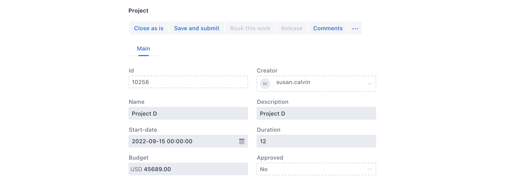

This page represents a work item that can then be channeled through a workflow
such as below:

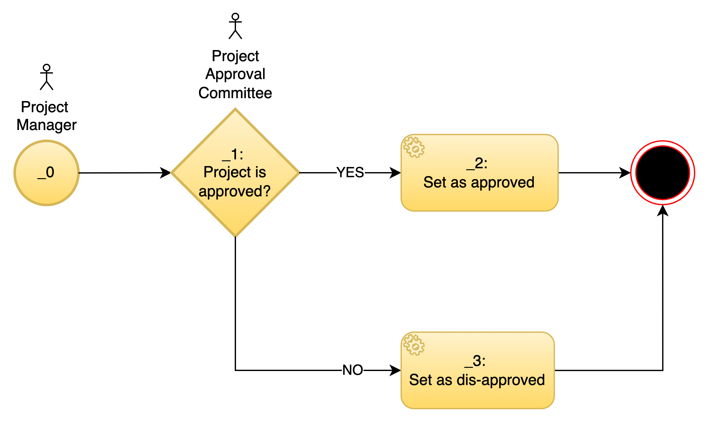

With XML representation:

~~~~~~~~~~~~~~~~~~~~~~~~~~~~~~~~~~~~~~~~~~~~~~~~~~~~~~~~~~~~~~~~~~~~~~~~~~~~~~~~
<?xml version="1.0" encoding="UTF-8" ?>
<bizProcess xmlns:xsi="http://www.w3.org/2001/XMLSchema-instance"
xsi:noNamespaceSchemaLocation="workflow.xsd">
    <name>ProjectWorkflow</name>
    
    <version>1.0</version>
    <description>Project Workflow</description>
    <workflow>
        <startEvent
            id='_0'
            canBeStartedBy='Project-Manager'
            description='Project'
            next='_1'/>
        <xor-unanimous-approval
            description='Project Approval'
            id='_1'
            handledBy='Project-Approval-Committee'>
            <byDefault next="_3"/>
            <onApproved  next="_2"/>
        </xor-unanimous-approval>      
        <service
            id='_2'
            next='END'
            description='Set Approved'>
            
        </service>
        <service
            id='_3'
            next='END'
            description='Set Dis-Approved'>
            
        </service>
       
        <end id='END'/>
    </workflow>
</bizProcess>
~~~~~~~~~~~~~~~~~~~~~~~~~~~~~~~~~~~~~~~~~~~~~~~~~~~~~~~~~~~~~~~~~~~~~~~~~~~~~~~~

 

Component Architecture
----------------------

 

Langkuik takes advantages of different open source component to achieve its goal
as an intuitive declarative and robust workflow engine.

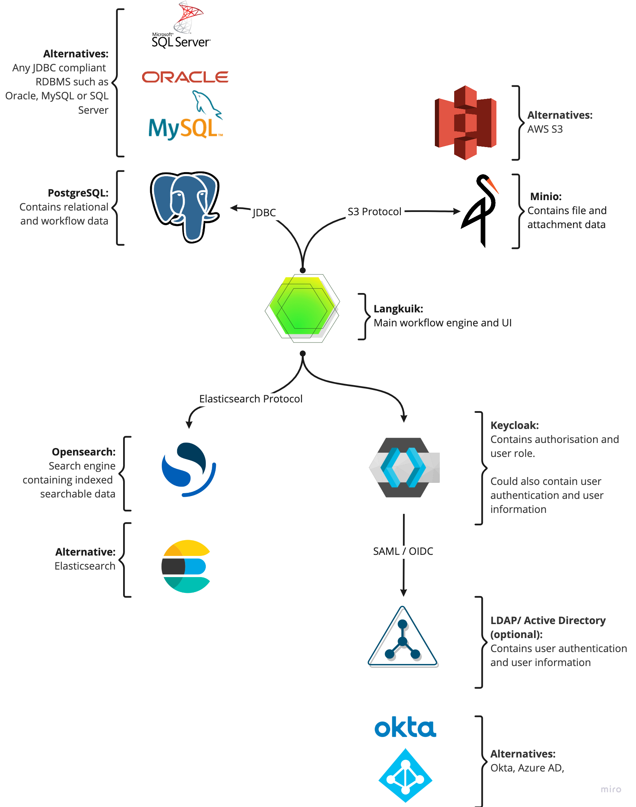

**Postgresql**

Postgresql is used as our relational database. Theoretically, Langkuik is
compatible with any JDBC compliant database

 

**Minio**

We use Minio as a distributed and robust object / file management system to
handle our attachment needs. Since Minio is S3 protocol compatible, Langkuik
should also work well with Amazon S3

 

**Keycloak**

We use Keycloak to help us manage a few things

-   As a way to connect to multiple user store / user authentication services
    such as LDAP or Active Directory.

-   As a authorisation service. Keycloak would contain all our roles management

-   Alternatively, in some set up, Keycloak can also take over from LDAP /
    Active Directory as user store

-   One advantage of Keycloak is that it enables authentication to be delegated
    to other identity datasource. Because of this, we should be able to
    integrate to any SAML or OIDC compatible user storage such as Octa or Azure
    Active Directory

 

**LDAP / Active Directory**

Many organisations have adopted LDAP or Active Directory for authentication
purposes. Having a single place to manage employees / users is very convenient
and secure. Langkuik supports LDAP or Active Directory through Keycloak.

Please refer to Keycloak documentation here for more information and setup
instructions <https://www.keycloak.org/docs/latest/server_admin/#_ldap>

 

**Open​search**

We use Opensearch as a search engine to store searchable data. We use
elasticsearch protocol and therefore is also compatible with Elasticsearch.

 

 

Deployment architecture
-----------------------

Langkuik, being a Spring Boot application, can be deployed in diverse ways. The
one below is what we are suggesting as a typical production setup.'

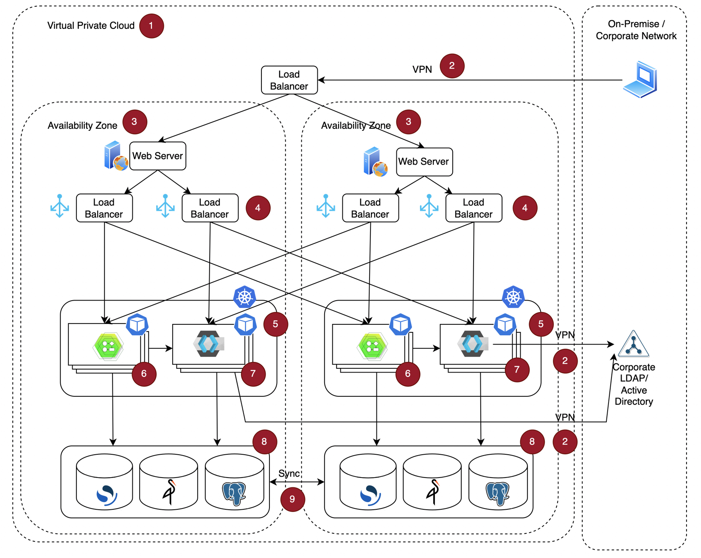

1.  Langkuik is a workflow application. As most workflow applications are
    internal to an organisation, we suggest a Virtual Private Cloud (VPC) set
    up. This will allow us to properly isolate our application from the rest of
    the world. If Langkuik is deployed in a local corporate data centre, then we
    do not need a VPC.

2.  Connecting from a corporate network to Langkuik should be done securely
    through VPN

3.  A request traffic will land on a Load Balancer which will then redirect
    traffic to multiple availability zones (Multi-AZ).

    We also assume that both AZ would work in parallel to allow scale as well as
    resiliency.

    Our web server would serve both Langkuik and Keycloak. Any static content
    should be cached at this level.

    In an on-prem deployment, we can consider each AZ as an isolated data
    center.

4.  We see another set of Load Balancers balancing the traffic between the two
    AZs

5.  It is recommended that Langkuik and Keycloak be deployed on a Kubernetes
    cluster.

6.  Both Langkuik and Keycloak should be packaged as Docker images to be
    deployed on a Kubernetes cluster and run as pods. The advantage of this is
    clear: Kubernetes will provide an extra layer of resiliency and
    repeatability to our application. Both Langkuik and Keycloak will be
    packaged with proper certificates to secure their connectivity.

7.  As we can see here, we actually deploy Keycloak as a container instead of
    leveraging managed services. Keycloak would then connect to internal
    corporate identity provider such as Active Directory through another VPN
    secured line.

    The ’text book’ way to achieve resiliency of Keycloak is to deploy it in
    cluster. Here, we will leverage Kubernetes resiliency instead. We will
    delegate data resiliency to our managed database.

8.  For data services (RDBMS, object storage and search) we will leverage
    managed services. For on-prem deployment, we can consider the options below

    -   RDBMS: CockroadDB - a Postgresql compatible, highly resilient,
        distributed RDBMS

    -   Storage : Minio - an S3 compatible, highly resilient, distributed object
        storage

    -   Search: Elasticsearch - A highly resilient, distributed search engine

 

All our services (both Langkuik and its dependencies) are secured through TLS.

 

 

 

Workflow
--------

The workflow is modelled using XML. The tags in our XML is as per below

-   Tag - `bizProcess`

    -   This is the root tag. It must point to `workflow.xsd`

-   Tag `- name`

    -   This is the name of the overall business process

-   Tag - `version`

    -   This contains the version of the business process

-   Tag `- description`

    -   This contains a free-text description of the business process

-   Tag `- workflow`

    -   This is where the we specify the connectivity between nodes

    -   Under workflow we could have several other elements

    -   Tag - `startEvent`

        Start event represents the activity at the beginning of the workflow. It
        has multiple fields

        -   `id`: identity of the activity. The identity must start with a
            letter and must not contain space or special characters

        -   `canBeStartedBy`: contains a space-delimited list of roles who can
            start the workflow

        -   `next`: the id of the next activity in the workflow

        -   `supervisoryApprovalHierarchy`: a list of space-delimited list of
            managers’ role who needs to approve the request. Please see
            supervisor management

        -   E.g:

            ~~~~~~~~~~~~~~~~~~~~~~~~~~~~~~~~~~~~~~~~~~~~~~~~~~~~~~~~~~~~~~~~~~~~
            <startEvent
                id='S0.START'
                canBeStartedBy='Relationship-Manager Branch-Staff'
                next='S1.CALL_BUREAU'
                supervisoryApprovalHierarchy='Manager HOD'
            />  
            ~~~~~~~~~~~~~~~~~~~~~~~~~~~~~~~~~~~~~~~~~~~~~~~~~~~~~~~~~~~~~~~~~~~~

             

    -   Tag - `end`

        -   This signify the end of the workflow

         

    -   Tag - `human`

        Represents an activity where a human user would need to handle a work
        within this activity. This could include completing an existing activity
        with new information, correcting a work that was rejected further down
        the workflow or correcting a rejection from a supervisor. Do note that
        approvals are not handled within this activity, rather, we have
        specialised activities for approvals. The parameters of this activities
        are:

        -   `id`: identity of the activity. The identity must start with a
            letter and must not contain space or special characters

        -   `description`: Human friendly description of the activity

        -   `handledBy`: contains the role who have access and and can pick up
            the work in this activity. We can only associate one role to one
            activity

        -   `next`: the next activity in the workflow

        -   `supervisoryApprovalHierarchy`: a list of space-delimited list of
            managers’ role who needs to approve the request. Please see
            supervisor management. In short, based on the example below, Manager
            is the immediate supervisor of a personnel while an HOD is the
            supervisor of a Manager.

    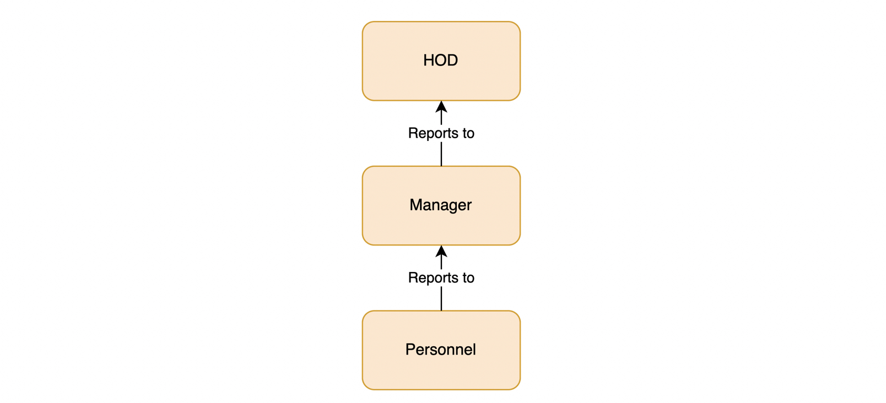

    In the example below, when work is submitted a work in this worklist, it
    will be routed to Manager and HOD for approval first before it moves to the
    next worklist / activity.

    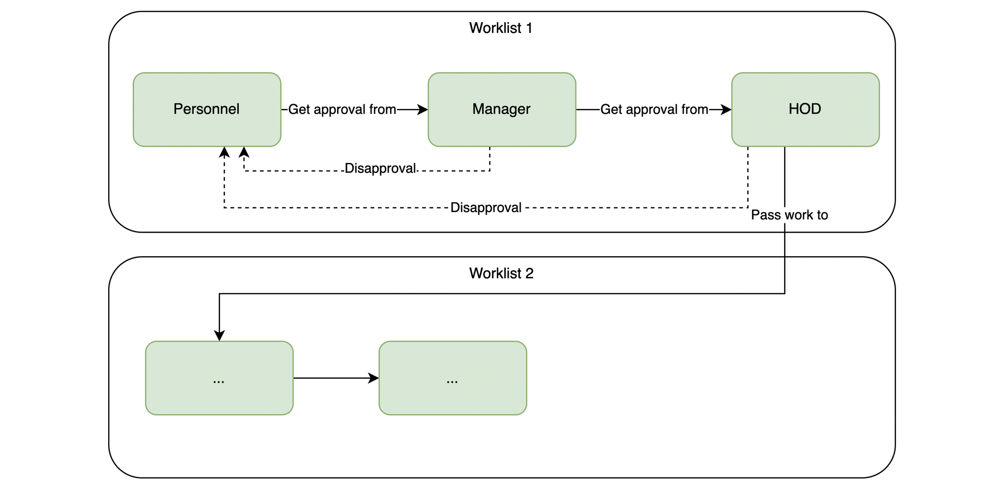

     

    -   `slaInHours`: The number of hours before this activity is considered
        breaching SLA

        -   E.g.

            ~~~~~~~~~~~~~~~~~~~~~~~~~~~~~~~~~~~~~~~~~~~~~~~~~~~~~~~~~~~~~~~~~~~~
            <human
                id='S4.UNDERWRITING'
                description='Underwriting'
                next='S5.UW_CHECKER'
                handledBy='Underwriter-Maker'
                supervisoryApprovalHierarchy='Manager HOD'
                slaInHours='24'
            />
            ~~~~~~~~~~~~~~~~~~~~~~~~~~~~~~~~~~~~~~~~~~~~~~~~~~~~~~~~~~~~~~~~~~~~

         

    -   Tag - `service`

        A service provides a way for us to execute a script. This activity is
        considered ’straight through processing’ (STP). An STP process is when
        no human intervention is needed and therefore is executed directly when
        the previous activity is done. No queue press is allocated to STP
        activities. This activity has a few parameters as below:

        -   `id`: identity of the activity. The identity must start with a
            letter and must not contain space or special characters

        -   `description`: Human friendly description of the activity

        -   next: the next activity in the workflow

        -   Tag - `script`

            -   This contains the script to be executed. The script is based on
                Groovy and has access to the workflow variable below:

            -   Please see the Script paragraph for more information

        -   E.g.

            ~~~~~~~~~~~~~~~~~~~~~~~~~~~~~~~~~~~~~~~~~~~~~~~~~~~~~~~~~~~~~~~~~~~~
             <service
                id='S50.SET_APPROVED'
                next='S10.INFORM_CUSTOMER'
                description='Set disapproved'>
                
            </service>
            ~~~~~~~~~~~~~~~~~~~~~~~~~~~~~~~~~~~~~~~~~~~~~~~~~~~~~~~~~~~~~~~~~~~~

     

    -   Tag - `xor`

        The activity `xor` is an STP activity that would direct the workflow
        execution down one of its branches. The branches are equipped with
        conditions and the first branch with a positive condition will be
        followed. In case that no branch is positive, the workflow will follow
        the default branch.

        Note that it is up to the developer to ensure the condition on the
        branches are mutually exclusive (i.e. no two branches should result in a
        positive condition). There is no guarantee of execution ordering, so the
        first randomly selected positive branch will always be followed even if
        there are other positive branches.

        Below are the properties of this activity:

        -   `id:` identity of the activity. The identity must start with a
            letter and must not contain space or special characters

        -   `description`: Human friendly description of the activity

        -   Tag - `byDefault`

            -   `next`: the activity id to be followed if none of the branches
                are positive

        -   Tag - `branch` (multiple)

            -   `condition`: A Spring Expression Language (SPeL) script that
                will return true or false. A true statement will indicate that
                this branch is positive

            -   `next:` the activity id to be followed if the condition is
                positive

        E.g.

        The activity prior to this will call a Credit Bureau API and from the
        result, the `xor`activity will follow one branch or another.

        ~~~~~~~~~~~~~~~~~~~~~~~~~~~~~~~~~~~~~~~~~~~~~~~~~~~~~~~~~~~~~~~~~~~~~~~~
        <xor
           id='S1.1.CALL_BUREAU_DECISION'
           description='Call bureau'>
              <byDefault next='S1.1.1.BUREAU_DISAPPROVE'/>
              <branch condition='currentObject
                .getProperties()
                .get("BUREAU_SCORE")==null' 
                next='S1.1.2.BUREAU_RETRY'/>
              <branch condition='currentObject
                .getProperties()
                .get("BUREAU_SCORE")>50' 
                next='S1.1.3.BUREAU_APPROVE'/>
        </xor> 
        ~~~~~~~~~~~~~~~~~~~~~~~~~~~~~~~~~~~~~~~~~~~~~~~~~~~~~~~~~~~~~~~~~~~~~~~~

     

    -   Tag - `xor-unanimous-approval`

        This is an approval activity where all users within a particular role
        (indicated by the property handledBy) must approve this work before it
        flows. Any rejection will result in the work following the default route
        instead.

        In the example below, all users with the role Supervisor must approve
        this work before it can flow to S8.DO_DISBURSEMENT. Any rejection will
        bring the work to S12.CORRECT_DISBURSEMENT_II instead.

        Below are properties

        -   `id`: identity of the activity. The identity must start with a
            letter and must not contain space or special characters

        -   `description`: Human friendly description of the activity

        -   `handledBy`: contains the role who have access and and can pick up
            the work in this activity. We can only associate one role to one
            activity

        -   Tag - `byDefault`

            -   `next`: the activity id to be followed if any rejection happens

        -   Tag - `onApproved`

            -   `next:` the activity id to be followed if all users having the
                role assigned to this activity approve the work

        E.g.

        ~~~~~~~~~~~~~~~~~~~~~~~~~~~~~~~~~~~~~~~~~~~~~~~~~~~~~~~~~~~~~~~~~~~~~~~~
        <xor-unanimous-approval
                    id='S11.DISBURSEMENT_DECISION'
                    description='Disbursement Decision'
                    handledBy='Supervisor'
                 >
                     <byDefault next="S12.CORRECT_DISBURSEMENT_II"/>
                     <onApproved next="S8.DO_DISBURSEMENT"/>
                 </xor-unanimous-approval>
        ~~~~~~~~~~~~~~~~~~~~~~~~~~~~~~~~~~~~~~~~~~~~~~~~~~~~~~~~~~~~~~~~~~~~~~~~

     

    -   Tag - `xor-atleast-one-approval`

        This is another approval activity. Here, only one approval is needed for
        the work to be considered approved and flow to the approved branch. If
        no approval is obtained (unanimous rejection), work will flow to the
        default branch.

        Below are properties

        -   `id`: identity of the activity. The identity must start with a
            letter and must not contain space or special characters

        -   `description`: Human friendly description of the activity

        -   `handledBy`: contains the role who have access and and can pick up
            the work in this activity. We can only associate one role to one
            activity

        -   Tag - `byDefault`

            -   `next`: the activity id to be followed if any rejection happens

        -   Tag -`onApproved`

            -   `next`: the activity id to be followed if, at least one user,
                having the role assigned to this activity, approve the work

        ~~~~~~~~~~~~~~~~~~~~~~~~~~~~~~~~~~~~~~~~~~~~~~~~~~~~~~~~~~~~~~~~~~~~~~~~
        <xor-atleast-one-approval
                    id='S5.UW_CHECKER'
                    handledBy='Underwriter-Checker'>
                    <byDefault next="S51.SET_DISAPPROVED"/>
                    <onApproved  next="S50.SET_APPROVED"/>
                </xor-atleast-one-approval>
        ~~~~~~~~~~~~~~~~~~~~~~~~~~~~~~~~~~~~~~~~~~~~~~~~~~~~~~~~~~~~~~~~~~~~~~~~

     

    -   Tag - `xor-majority-approval`

        This activity is an approval activity. We would need the majority of
        users having the role registered at this activity to approve this work
        for the work to be considered approve. The work will then flow to the
        approved branch of the activity.

        If we have a majority of rejection, the work will then flow to the
        default branch.

        In case where we have an even number of approvers and we are at a tie,
        then we will follow a tie-breaker branch. The tie breaker should be
        another approval activity (xor-atleastone-approval or
        xor-unanimous-approval) where the next level of approval can happen to
        break the tie.

        Below are properties

        -   `id`: identity of the activity. The identity must start with a
            letter and must not contain space or special characters

        -   `description`: Human friendly description of the activity

        -   `handledBy`: contains the role who have access and and can pick up
            the work in this activity. We can only associate one role to one
            activity

        -   Tag - `byDefault`

            -   `next`: the activity id to be followed if if the majority of
                users rejected this work

        -   Tag - `onApproved`

            -   `next`: the activity id to be followed if the majority of users,
                having the role assigned to this activity, approve the work

        -   Tag - `onTieBreaker`

            -   `next`: the activity id to be followed if there are as many
                users approving and rejecting this activity.

     

### Identifying users

In keeping with the spirit of flexibility of the system. We provide 2 interfaces
to allow user query.

 

-   `UserIdentifierLookup`

    Langkuik user would need to provide the implementation of this interface to
    bridge between the Keycloak user id (obtained when a user successfully login
    to Keycloak) and Langkuik. With LDAP, for example, the Keycloak user map
    (containing the user information obtained through Keycloak) is being queried
    for `LDAP_ENTRY_DN.` An LDAP entry DN (e.g. `cn=Clara
    Holmes,ou=people,o=sevenSeas`) would be used as a full-fledge user
    identifier in Langkuik.

    ~~~~~~~~~~~~~~~~~~~~~~~~~~~~~~~~~~~~~~~~~~~~~~~~~~~~~~~~~~~~~~~~~~~~~~~~~~~~
    @Service
    public class LdapUserIdentifierLookup  implements UserIdentifierLookup{

        public Optional<String> lookup(Map keycloakUserMap) {
            Map attributes = (Map)keycloakUserMap.get("attributes");
            if (attributes!=null){
                List ldapEntryList = (List)attributes.get("LDAP_ENTRY_DN");
                if (ldapEntryList!=null || !ldapEntryList.isEmpty()){
                    return Optional.ofNullable((String)ldapEntryList.get(0));
                }
            }
            return Optional.empty();
        }

        public Optional<String> lookup(UserProfile user) {
            return Optional.of(user.getUserIdentifier());
        }

    }
    ~~~~~~~~~~~~~~~~~~~~~~~~~~~~~~~~~~~~~~~~~~~~~~~~~~~~~~~~~~~~~~~~~~~~~~~~~~~~

 

-   `UserNameFormatter`

    As we can see from the example above, a user identifier is not necessarily
    UX friendly (e.g. `cn=Clara Holmes,ou=people,o=sevenSeas`). We would need a
    service to convert user identifier to human readable user name. To do this,
    we would need to override the `UserNameFormatter` as below:

    ~~~~~~~~~~~~~~~~~~~~~~~~~~~~~~~~~~~~~~~~~~~~~~~~~~~~~~~~~~~~~~~~~~~~~~~~~~~~
    @Service
    public class LdapUserNameFormatter implements UserNameFormatter {

        @Override
        public String format(String userIdentifier) {
            if (userIdentifier==null){
                return "";
            }
            String s = userIdentifier;
            try {
                LdapName ln = new LdapName(userIdentifier);

                for (Rdn rdn : ln.getRdns()) {
                    if (rdn.getType().equalsIgnoreCase("CN")) {
                        s =  (String) rdn.getValue();
                    }
                }
            } catch (InvalidNameException ex) {
                //if exception occurs, 
                //the userIdentifierPassed is not LDAP compatible
            }
            return s;
        }
    }
    ~~~~~~~~~~~~~~~~~~~~~~~~~~~~~~~~~~~~~~~~~~~~~~~~~~~~~~~~~~~~~~~~~~~~~~~~~~~~

    In the listing above, we would query the CN part of the LDAP entry DN string
    and return it as a proper user name

     

     

### Supervisor management

How would we determine the hierarchy in an organisation? That is actually a
difficult problem. For organisations with Active Directory or LDAP, these
systems can be leveraged to store hierarchy information.

Even then, the model might be different from one organisation to the next. In
one organisation, a hierarchy might be modelled as a field attached to every
personnel called ‘manager’. This field will point to the supervisor of the
personnel.

In another organization, a manager field might be attached to a group instead.
Every personnel belonging to the group will report to the manager of the group.

For smaller organisations, the hierarchy information is not stored in a system
purse. It is probably captured in some spreadsheet or represented as an org
chart on a wall instead.

To allow for multiple options, instead of providing a concrete library, we are
providing our user with an implementable interface instead. Langkuik users can
implement these interfaces to look up their own custom organization hierarchy.
We are also providing 2 implementations of this interface covering hierarchy in
typical LDAP or Keycloak.

 

To understand how this work, we need to go back to our workflow. In our
workflow, for both of the nodes below, we can specify a list of approving
manager roles in a hierarchy.

Recall that E.g.

~~~~~~~~~~~~~~~~~~~~~~~~~~~~~~~~~~~~~~~~~~~~~~~~~~~~~~~~~~~~~~~~~~~~~~~~~~~~~~~~
<startEvent 
            ...
            supervisoryApprovalHierarchy='Manager HOD'/>
<human
            ...
            supervisoryApprovalHierarchy='Manager HOD'
            .../>
~~~~~~~~~~~~~~~~~~~~~~~~~~~~~~~~~~~~~~~~~~~~~~~~~~~~~~~~~~~~~~~~~~~~~~~~~~~~~~~~

 

With Manager being the immediate supervisor of the personnel and HOD being the
supervisor of the supervisor or the personnel as per below:

Let’s assume that we store the hierarchy above in an LDAP server using the field
Manager attached to every Personnel.

To lookup a Manager in LDAP, we would implement the `ApproverLookup`interface as
per below:

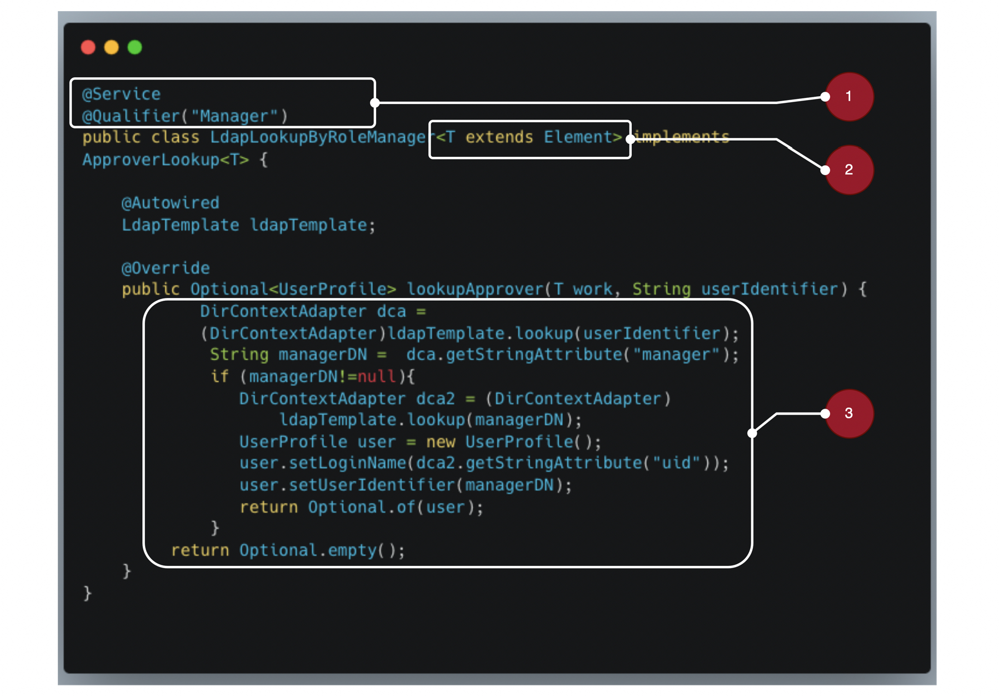

1.  The implementation must be a Spring service (having the `@Service`
    annotation) and must have a `@Qualifier`. The value of the qualifier must
    match the same value in the field `supervisoryApprovalHierarchy` in the
    workflow.

2.  We must constraint our generic to `Element`

3.  Here is where we use Spring’s `LdapTemplate` to query the 'manager' field of
    the user.

 

 

To implement an HOD look up, we re-implement the same interface with a different
qualifier as per below

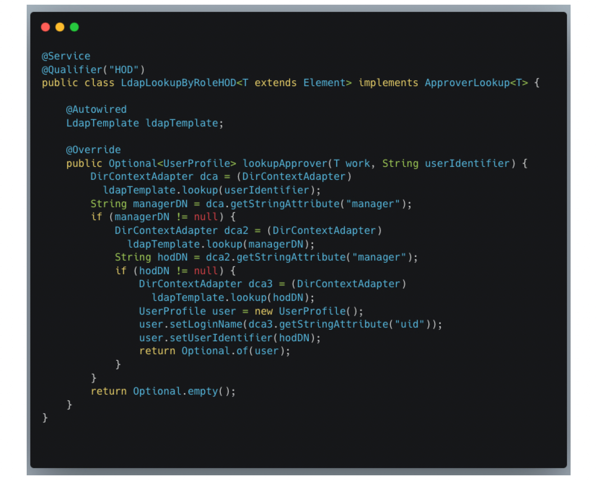

What we do here is basically to look do the query twice. Once to query the
manager of the current personnel, then query the manager of the manager.

Additionally, we need to configure Spring's `LdapTemplate`. We use the
configuration code below. Notice that `ldap.username` and `ldap.password` are
taken from application.properties file (see General Application Configuration)

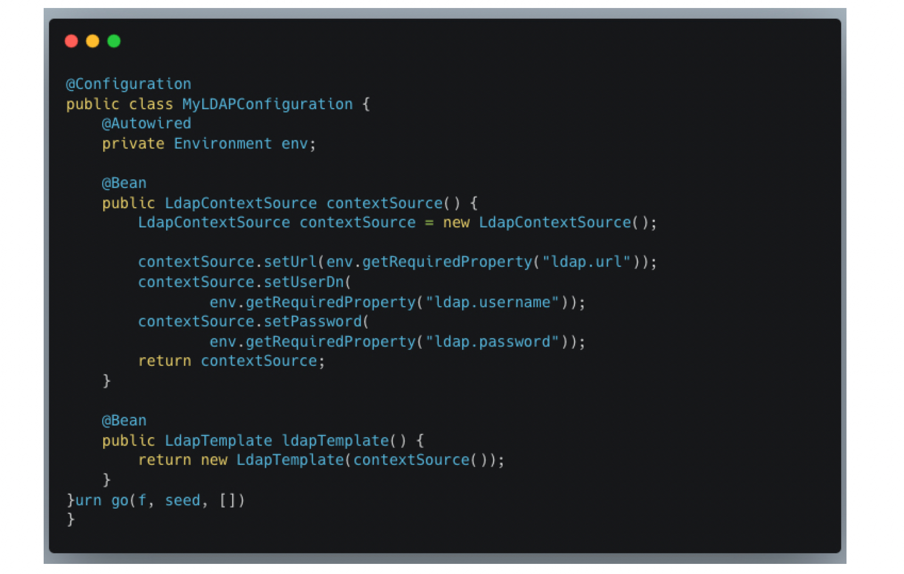

 

### Discussion on search

There are 2 objectives when it comes to search

1.  Allow fields to be searched

2.  Allow search to go from root all the way to the leaf objects

 

 

### Allowing String typed field to be searched

There are 2 ways to achieved this depending on what we String field consist of.

-   If the String field consist on singular value (such as country name or
    person name), then we should use the the `KeywordField` annotation. E.g.

    ~~~~~~~~~~~~~~~~~~~~~~~~~~~~~~~~~~~~~~~~~~~~~~~~~~~~~~~~~~~~~~~~~~~~~~~~~~~~
    @GenericField(sortable = Sortable.YES, searchable = Searchable.NO)
    @KeywordField(name = "Last-name", searchable = Searchable.YES)
    @WebField(displayName = "Last-name", order = 200, visibleInTable = "false")
    private String lastName;
    ~~~~~~~~~~~~~~~~~~~~~~~~~~~~~~~~~~~~~~~~~~~~~~~~~~~~~~~~~~~~~~~~~~~~~~~~~~~~

-   If the String field is in fact a long textual field (such as description),
    then we should use the `FullTextField` annotation. E.g

    ~~~~~~~~~~~~~~~~~~~~~~~~~~~~~~~~~~~~~~~~~~~~~~~~~~~~~~~~~~~~~~~~~~~~~~~~~~~~
    @GenericField(sortable = Sortable.YES, searchable = Searchable.NO)
    @FullTextField(name = "Description", searchable = Searchable.YES)
    @WebField(displayName = "Description", order = 200, visibleInTable = "false")
    private String lastName;
    ~~~~~~~~~~~~~~~~~~~~~~~~~~~~~~~~~~~~~~~~~~~~~~~~~~~~~~~~~~~~~~~~~~~~~~~~~~~~

 

### Allowing other type of fields to be searched

-   Other type of fields (such as dates or numbers) can also be searched by
    using the GenericField field annotation

    ~~~~~~~~~~~~~~~~~~~~~~~~~~~~~~~~~~~~~~~~~~~~~~~~~~~~~~~~~~~~~~~~~~~~~~~~~~~~
    @GenericField(sortable = Sortable.YES, searchable = Searchable.NO)
    @GenericField(name = "Start-date", searchable = Searchable.YES)
    @WebField(displayName = "Start-date", order = 300)
    private LocalDate startDate;
    ~~~~~~~~~~~~~~~~~~~~~~~~~~~~~~~~~~~~~~~~~~~~~~~~~~~~~~~~~~~~~~~~~~~~~~~~~~~~

###  

### Why do we need 2 annotations for search?

-   We have 2 annotations (sometimes`GenericField`and `KeywordField`, sometimes
    `GenericField` and `FullTextField`, sometimes 2 `GenericField`s) because we
    need to cater for both sorting of search results and advance search.

-   We will call the advance searchable annotation as Type 1 (the annotation
    with the `name` property)

-   We will call the sortable annotation as Type 2 (the annotation contains
    `sortable=Sortable.YES`)

-   E.g

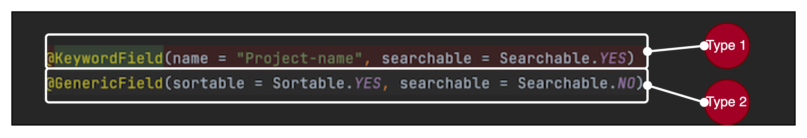

**Type 1 annotation** is used to do advance search using Lucene query language
[<https://www.lucenetutorial.com/lucene-query-syntax.html>]. Lucene query
language will use the name of the field displayed so in the example above, it
would be:

~~~~~~~~~~~~~~~~~~~~~~~~~~~~~~~~~~~~~~~~~~~~~~~~~~~~~~~~~~~~~~~~~~~~~~~~~~~~~~~~
Project-name:"MALAYSIA *"
~~~~~~~~~~~~~~~~~~~~~~~~~~~~~~~~~~~~~~~~~~~~~~~~~~~~~~~~~~~~~~~~~~~~~~~~~~~~~~~~

And all projects with name starting with the word “MALAYSIA” will be listed

See the discussion on using Lucene query language

 

**Type 2 annotation** allows us to sort. When sorting, we would use the name of
the class field instead.

 

### Lucene Query Language

In order to understand how we use Lucene query, we need to understand the
convention that we have. We will learn this through an example.

Given a workflow system to manage Loan Application. We would have a (Loan)
`Application`class, an `Applicant`class and an`Address`class - inter-related as
per below.

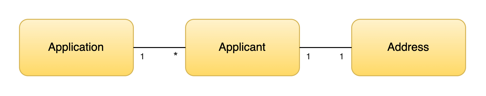

 

-   The class `Application`is as per below. The relationship with `Applicant`
    (through the field `applicants`) is shown rendered as a table.

    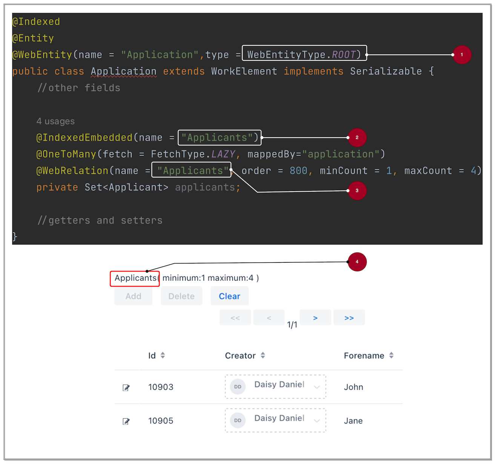

    Note that `Application` is the root

    Although the field is called `applicant` (with a small ‘a’), both
    `IndexedEmbedded.name`and `WebRelation.name` is using Applicant (with a
    capital ‘A’)

    The `WebRelation.name` is the one used in the rendered table

 

This brings us to our first convention

 

**Convention \#1:**

**In a relationship,** `WebRelation.name` and`IndexedEmbedded.name` must be the
same. They should be human-readable. Any space in between words are replaced
with a dash (-)

 

Secondly, we need our relationship to be `IndexedEmbedded`

**Convention \#2:**

**All relationships between classes must be** `IndexedEmbedded` **to allow
search from root to navigate data all the way to the the leaf. The implication
of Convention \#2 is that relationship must be bi-directional**

**One exception to Convention \#2 is when we are linking our workflow model with
Langkuik’s own model (such as** `AttachmentsContainer`**)**

 

-   The class `Applicant` will have the form below

    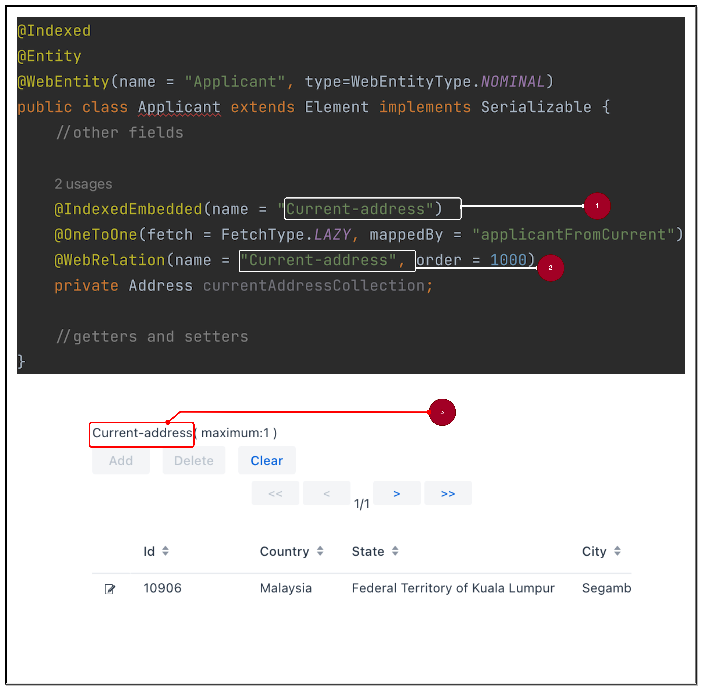

    1,2,3 The same convention \#1 applies

     

-   Next, we look at the `Address` class

    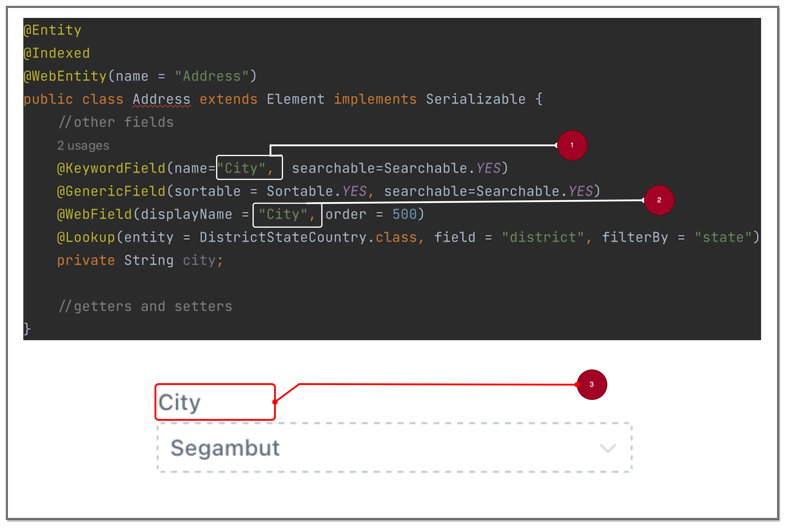

    As we can see, the `KeywordField.name` field (or `GenericField.name` in case
    of non-String or `FullTextField.name` in case of long String) and
    `WebField.displayName` are all the same.

    This brings us to the third convention

     

    **Convention \#3**

    **All searchable fields must have the annotations** `WebField` ,
    `GenericField`(for sorting) and one of`GenericField` (for search),
    `KeywordField` or `FullTextField`. The properties` WebField.displayName,
    GenericField.name`,` KeywordField.name`, or `FullTextField.name` must be the
    same. It must be human readable with spaces replaced with a dash (-)

 

-   If Convention \#1, \#2 and \#3 is followed, the we can do a search such as
    below

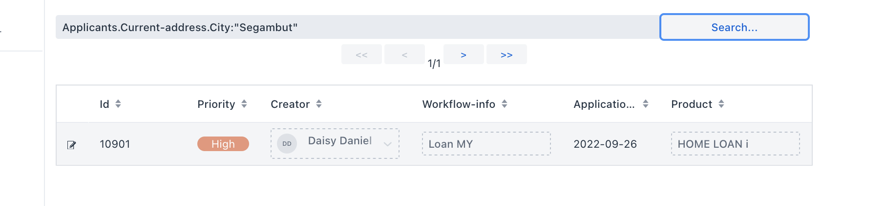

The dot indicates that we navigate from one object to another.

We use the `name/displayName` properties in the search since this is what the
user would see in their workflow form.

The search result is at the root level for now

 

### Support for advanced Lucene Query

We support advanced Lucene query such as

-   Range query

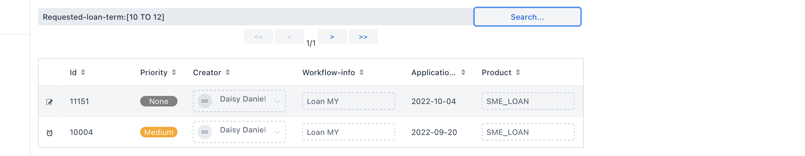

 

-   Date range query.

 

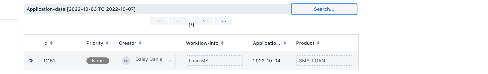

 

-   Wildcard matches

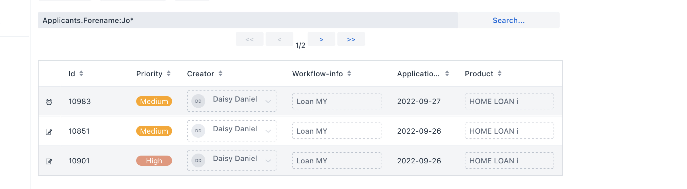

 

For more on Lucene query language, please visit
<https://lucene.apache.org/core/2_9_4/queryparsersyntax.html>

 

 

Classes
-------

 

### WorkElement

When building a workflow system, we need a way to model the “work” that is
flowing within the system. In Langkuik, this “work" objects are called
`WorkElement`s.

Do note that WorkElement must be of type `WebEntityType.ROOT`.

To create a work element, simply inherit the abstract class `WorkElement`, e.g.:

`WorkElement` will provide a few fields needed for us to track our work.

-   `id`:

    -   Designate the identity of this element. This id will be used as the
        primary key in the database

-   `priority`:

    -   Designate how important is the work represented by this element.
        Elements with higher priority will be coloured differently and will have
        a shortcut for us to access it quickly

-   `creator`:

    -   Designate the user who created this element in the first place

-   `tenant`

    -   In a multi-tenant solution, this field will indicate which tenant is
        this element belong to

-   `approvals`

    -   This field contains the list of approvals needed at the current stage of
        the workflow

-   `workflowInfo`

    -   This property contains a collection of information of this element in
        the workflow. It has a few properties on its own

        -   `status`

            -   Current status of the work

        -   `worklist`

            -   Indicates where in the workflow is this element right now

        -   `owners`

            -   Contains a list of the current owner of this stems

    -   This properties is only available to the root element

-   `commentsCollection`

    -   This property contains comments attached to this element as it flows
        through the workflow

 

### Element

In Langkuik, `Element`s represent generic business objects that serve as
dependents / compliment to the root `WorkElement`.

Do note that an Element must be of type `WenEntityType.NOMINAL` or
`WenEntityType.REF`

An Element has these fields:

-   `id`:

    -   Designate the identity of this element. This id will be used as the
        primary key in the database

-   `creator`:

    -   Designate the user who created this element in the first place

-   `tenant`

    -   In a multi-tenant solution, this field will indicate which tenant is
        this element belong to

 

### AttachmentsContainer

A field of type `AttachmentsContainer` represents file uploads. The file uploads
will be stored in Minio/S3 as configured. The `@WebRelation` annotation of the
field must have `customComponentInForm = AttachmentsRenderer.class`

Just like any other relationship tagged with `@WebRelation`, we can specify

 

Annotations
-----------

 

### \@WebEntity

`@WebEntity` is the annotation attached to an `Element` or a `WorkElement`. A
list of `@WebEntity` created by the current user are displayed when the user
logs in as per below.

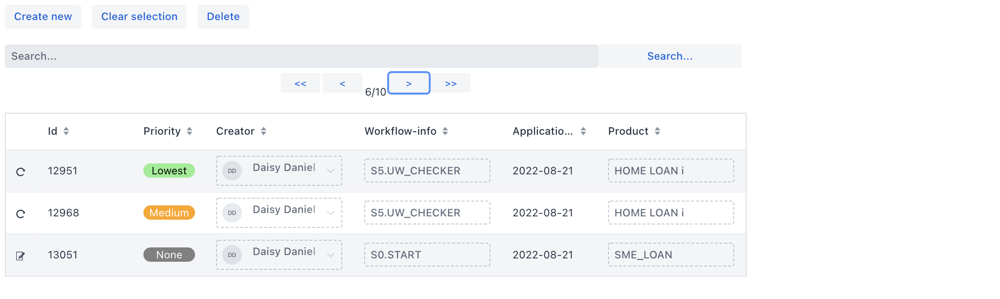

`@WebEntity` has multiple properties:

-   `name`

    -   Designate the human-readable name of this entity

-   `type`

    -   Designate the type of element. By default, an element is nominal (
        `WebEntityType.NOMINAL`)

    -   As we have seen in the`WorkElement` paragraph, a root object represents
        the work flowing within the workflow.

-   `fieldVisibility`

    -   By default, field visibility is controlled by the properties
        `visibleInField` and `visibleInTable` of the `@WebField` annotation

    -   The `fieldVisibility` property allow us to override the control above

    -   This is useful when we want to control the visibility of a parent class
        (for example the field priority in `WorkElement`)

    -   The `fieldVisibility`property consists of an array of `@FieldVisibility`
        of which the properties are

        -   `fieldName`

            -   A String designating the field name

        -   `visibleInForm`

            -   A String containing “true” or “false” controlling the visibility
                of this field in a form

            -   This property supports SPeL

        -   `visibleInTable`

            -   A String containing “true” or “false” controlling the visibility
                of this field in a table

            -   This property supports SPeL

 

 

### \@WebField

The annotation `@WebField` is attached to class fields. It indicates the fields
(of basic Java data types) of our data model. Below are some fields we can
create using the `@WebField` annotation.

-   Supported data types

    -   `LocalDate`

    -   `Timestamp`

    -   `Long`

    -   `Integer`

    -   `BigDecimal`

    -   `Boolean`

    -   `Status`

    -   `Set<String>` (Set of String) : We will display a comma separated data

-   Properties

    -   `displayName`

        -   This property will be displayed as the label of the field

    -   `order`

        -   This property indicates the order of the entity field. If two or
            more fields are having the same order, there will be no guarantee of
            ordering for those fields

    -   `visibleInTable`

        -   This property indicates if this entity field is visible in a table

        -   Support SPeL

    -   `visibleInForm`

        -   This property indicates if this entity field is visible in a form

        -   Support SPeL

    -   `rights`

        -   This property governs the edibility of a field. `@FieldAccess` has 2
            more properties

            -   `atWorklist`: Indicates the worklist where we are at

            -   `currentOwner`: Has 2 possible values

                -   `FieldRights.CAN_EDIT`: The current owner of this entity can
                    edit the entity field

                -   `FieldRights.CAN_ONLY_READ`: The current owner of this
                    entity can only read the entity field

            -   by default, the creator of an object would have full access to
                an object when the object is first created, unless access is
                specifically limited. E.g:

            ~~~~~~~~~~~~~~~~~~~~~~~~~~~~~~~~~~~~~~~~~~~~~~~~~~~~~~~~~~~~~~~~~~~~
            @FieldAccess(
                atWorklist = "ACTIVITY_0",
                currentOwner = FieldRights.CAN_ONLY_READ
            )
            private String partialResult;
            ~~~~~~~~~~~~~~~~~~~~~~~~~~~~~~~~~~~~~~~~~~~~~~~~~~~~~~~~~~~~~~~~~~~~

            -   In the example above, `ACTIVITY_0` is the start activity of the
                workflow. The field `partialResult`cannot be edited by the
                creator of the object

                -   We do this because we expect this field to be populated by
                    another role somewhere else down the workflow.

    -   `format`

        -   This property indicates the format of the field. Only applicable to
            `String` data type. `@Format` has a few more annotation fields

            -   `block`: This indicate the blocks of the data.

            -   `delimiters`: This indicate the delimiter between blocks.

                -   E.g if block is {2,4,3} and delimiter is {-,%}, we will
                    support, for example, the data: 12-3456%789

            -   `showPrefixImmediately`: this will indicate if the delimiters
                will be showed immediately as we type

            -   `type`: we support

                -   `Format.NUMERIC`: Numeric data only

                -   `Format.UPPER_CASE`: Automatic upper case

                -   `Format.NONE`: No format

        -   `isReadOnly`

            -   This property indicates if this field is read-only.

 

### \@WebRelation

A `@WebRelation` annotation is attached to a field representing the relationship
of multiple domain objects. E.g. A relationship between a Loan Application and
an Applicant. Typically, a relationship is displayed as a table in the parent’s
form as below. Double-clicking on the row will bring up a form dedicated to the
child item clicked.

We support one-to-many and one-to-one relationship. The properties of this
annotation is as per below:

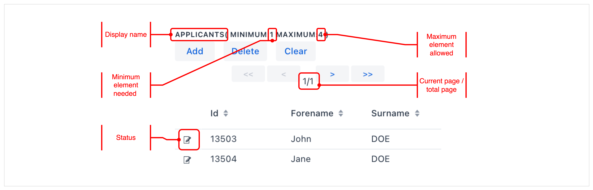

-   `name`

    -   contains the human readable name of the relationship. This will be used
        as display name

-   `order`

    -   the order in which the relationship appears in a form. Note that all
        `@WebField`s will be displayed first before `@WebRelation`s.

-   `maxCount`

    -   the maximum number of elements that can be put under this relationship
        if the relationship is of type one-to-many. Default is -1 : no limit.
        For one-to-one relationship, the `maxCount`is by default 1

-   `minCount`

    -   the minimum number of elements that must be present in this
        relationship. If we have less than `minCount`, the our form will not be
        considered valid and an error message will be displayed. Default is 0:
        no minimum

-   `visibleInTable`

    -   This property indicates if this entity field is visible in a table

    -   Support SPeL

-   `visibleInForm`

    -   This property indicates if this entity field is visible in a form

    -   Support SPeL

-   `customComponentInTable`

    -   A relationship usually does not appear as a field in the table of its
        parent. But, in case we want it to, we can specify the renderer here.

-   `asSubForm`

    -   This represents the configuration items for sub-form. Please see the
        discussion on `@SubForm`. If subform is left empty, the relationship
        will be displayed as a table in the main / parent form itself.

-   `rights`

    -   This property governs the edibility of a field. The rights can contain
        multiple `@RelationAccess`. `@RelationAccess` has 2 more properties

        -   `atWorklist`: Indicates the worklist where we are at

        -   `currentOwner`: Has 2 possible values

            -   `RelationRights.CAN_EDIT`: The current owner of this entity can
                edit the entity field

            -   `RelationRights.CAN_ADD_AND_DELETE_OWN_ITEMS` : The current
                owner of this entity can add and delete his own items.

             

There are two types of relationships:

-   a relationship between a root / nominal object and a nominal object (called
    nominal relationship)

    -   This relationship is as per the example above

-   a relationship between a root / nominal object with a reference object
    (called reference relationship)

    -   See the paragraph ‘Working with references’ for more info

         

 

In a reference relationship

 

### \@SubForm

-   Sub-form represents smaller forms attached to the bigger root level form.
    Any `@WebRelation` can be displayed as a sub-form using specialised
    renderers.

    -   `active`

        -   This indicates if the sub form is active or not. In-active sub-form
            is the equivalent of not specifying one

    -   `type`

        -   There are 3 types of sub form.

        -   The default` SubFormType.IN_PARENT`. In this type, the relationship
            will be displayed as a table directly in the main form as below:

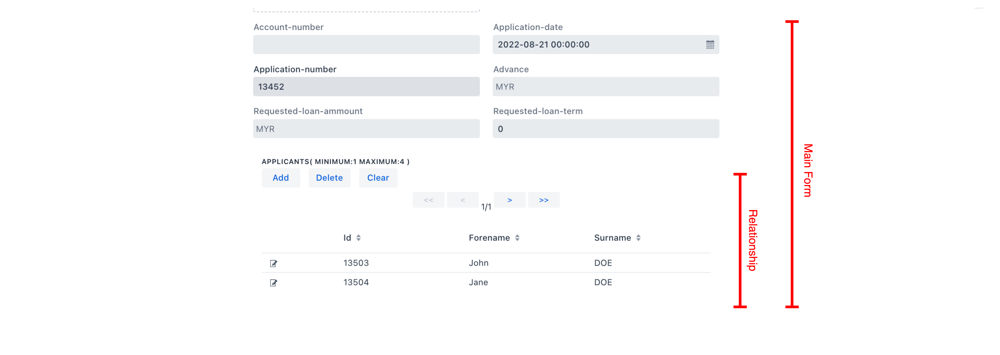

-   The set up below are equivalent. All of them will create a table in the
    parent / main form:

    ~~~~~~~~~~~~~~~~~~~~~~~~~~~~~~~~~~~~~~~~~~~~~~~~~~~~~~~~~~~~~~~~~~~~~~~~~~~~
        //Setup #1
        @WebRelation(name = "Applicants", 
                    order = 800, 
                    minCount = 1, 
                    maxCount = 4) //no subform specified
        ...
        //Setup #2
        @WebRelation(name = "Applicants", 
                    order = 800, 
                    minCount = 1, 
                    maxCount = 4,
                    asSubForm = @SubForm( 
                            active = true,
                            type =SubFormType.IN_PARENT
                    ))
        ...
         //Setup #3
        @WebRelation(name = "Applicants", 
                    order = 800, 
                    minCount = 1, 
                    maxCount = 4,
                    asSubForm = @SubForm( 
                            active = false,
                            type = ...
                            asSubForm = ...
                    )) 
    ~~~~~~~~~~~~~~~~~~~~~~~~~~~~~~~~~~~~~~~~~~~~~~~~~~~~~~~~~~~~~~~~~~~~~~~~~~~~

    -   The second type: `SubFormType.AS_TAB.`In this type, the relationship
        will be displayed as a tab.

        -   With this option, we would like to avoid tabs within tabs

            -   Because of this, the `AS_TAB` option is only applicable to
                relationship between a root `WorkElement` to other `Element`s.
                It will not work for relationship between an `Element` to other
                `Element`s.

        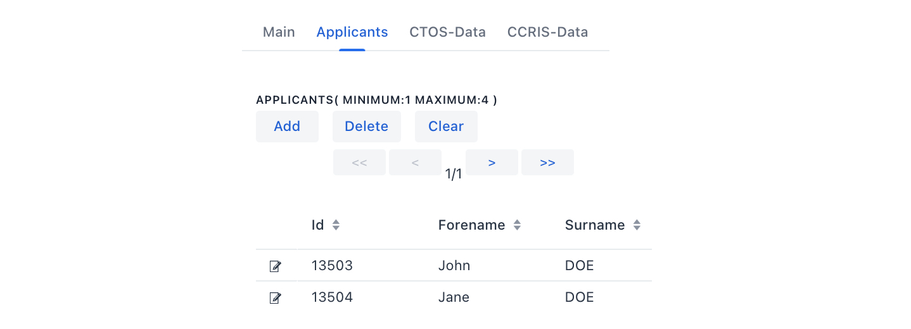

        -   The third type: `SubFormType.AS_POPUP.`In this type, a button will
            be displayed on the main form. When we click on the button, the
            relationship table will appear in a dialog.

            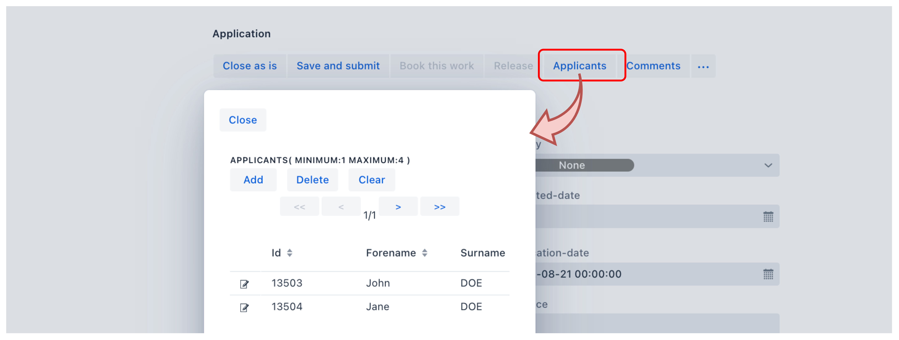

    -   `subFormRenderer`

        -   This contains the renderer class that will display this relationship
            differently from the default. Without this renderer, the
            relationship will be displayed as a table.

        -   Langkuik comes with a few renderer out of the box:

         

        -   `AttachmentsRenderer.class`

            -   This renderer would create a table of files uploaded. The user
                would also be provided with a button to upload attachment (if
                allowed)

            -   Constraint:

                -   The field must be of `AttachmentsContainer` type

            -   Example:

                ~~~~~~~~~~~~~~~~~~~~~~~~~~~~~~~~~~~~~~~~~~~~~~~~~~~~~~~~~~~~~~~~
                 @OneToOne(fetch = FetchType.LAZY, 
                           cascade = CascadeType.ALL
                 )
                 @JoinColumn(name = "attachments_id",
                            referencedColumnName = "id"
                 )
                 @WebRelation(name = "Attachments", 
                            order = 1500, 
                            maxCount = 5,
                            asSubForm=
                                @SubForm(
                                    active = true,
                                    subFormRenderer=
                                        AttachmentsRenderer.class,
                                    type = SubFormType.IN_PARENT
                                )
                  )
                  private AttachmentsContainer attachments;
                ~~~~~~~~~~~~~~~~~~~~~~~~~~~~~~~~~~~~~~~~~~~~~~~~~~~~~~~~~~~~~~~~

            -   This will render to the component below.

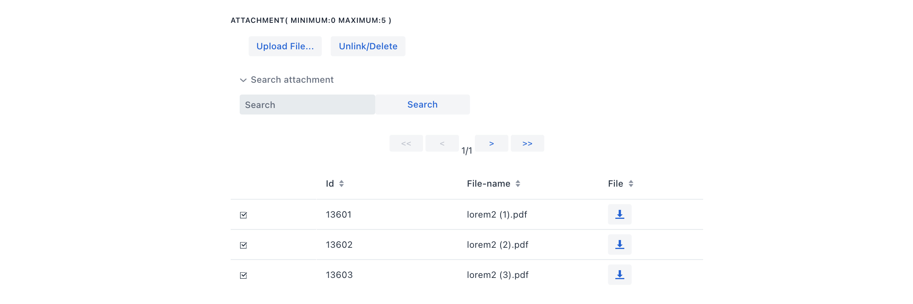

-   Some features:

    -   Upload or delete file

        -   Download file

            -   Upload size can be constraint in application.properties (see
                General Application Properties)

                -   Search within document

                -   Maximum and minimum

                -   We can specify the maximum number of file we can upload
                    through `maxCount`

                -   We can specify the minimum number of file that is needed
                    through `minCount`

                 

    -   `RelationToFormRenderer.class`

        -   This renderer will turn a related element to a form

        -   Constraint: Only work for one-to-one relationship.

        -   Example:

            -   With renderer:

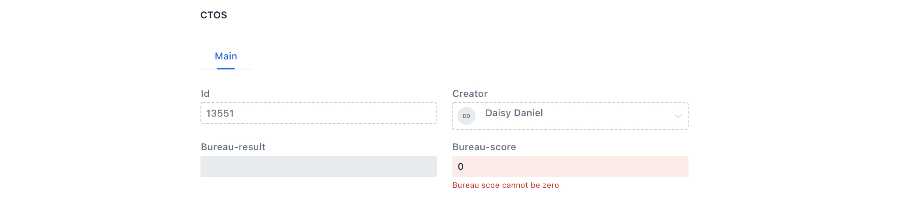

-   Without renderer

 

### \@Money

This annotation is attached to a field of type BigDecimal. This will make the
field to represent its value with a currency symbol.

There are two parameters

-   `currency`:

    -   ISO 4217 based currency symbol. If empty, the currency will be based on
        system local.

-   `decimalPlace`:

    -   The number of decimal place for the field. Default is 2

 

### \@Lookup

-   The lookup annotation can be used to associate a drop-down field to a
    database field table. It is attached to a field with`String` data type.

    To use this, we first need to create an `Element` of type reference
    (`WebEntityType.REF`)

    -   `entity`:

        -   Contains the class representing the reference table

    -   `field`:

        -   The field of the reference table that will be looked up when this
            drop down field is clicked

    -   `filterBy`:

        -   The field of the current object that will be used to filter the drop
            down list

 

E.g.:

~~~~~~~~~~~~~~~~~~~~~~~~~~~~~~~~~~~~~~~~~~~~~~~~~~~~~~~~~~~~~~~~~~~~~~~~~~~~~~~~
@Entity
@DiscriminatorValue("DistrictStateCountry")
@WebEntity(name = "District State Country", type = WebEntityType.REF)
public class DistrictStateCountry extends Element {

    @WebField(displayName = "District", order = 200)
    private String district;

    @WebField(displayName = "State", order = 300)
    private String state;

    @WebField(displayName = "Country", order = 400)
    private String country;

    //constructors and accessors
}
~~~~~~~~~~~~~~~~~~~~~~~~~~~~~~~~~~~~~~~~~~~~~~~~~~~~~~~~~~~~~~~~~~~~~~~~~~~~~~~~

 

We can then associate the fields here to a drop down list. E.g:

~~~~~~~~~~~~~~~~~~~~~~~~~~~~~~~~~~~~~~~~~~~~~~~~~~~~~~~~~~~~~~~~~~~~~~~~~~~~~~~~
@WebField(displayName = "Country", order = 300)
@Lookup(entity = DistrictStateCountry.class, field = "country")
private String country;
~~~~~~~~~~~~~~~~~~~~~~~~~~~~~~~~~~~~~~~~~~~~~~~~~~~~~~~~~~~~~~~~~~~~~~~~~~~~~~~~

 

And this will be rendered as:

-   Secondarily, we can make one lookup filtered by another lookup. For example,
    when we choose a country, only states within that country is shown in the
    state drop down. And when choosing a state, only districts within that state
    is shown in the district dropdown.

    To achieve this, we can specify filtering using the `filteredBy` property as
    per below:

    ~~~~~~~~~~~~~~~~~~~~~~~~~~~~~~~~~~~~~~~~~~~~~~~~~~~~~~~~~~~~~~~~~~~~~~~~~~~~
        @WebField(displayName = "State", order = 400)
        @Lookup(
            entity = DistrictStateCountry.class, 
            field = "state", 
            filterBy = "country")
        private String state;

        @WebField(displayName = "City", order = 500)
        @Lookup(
            entity = DistrictStateCountry.class, 
            field = "district", 
            filterBy = "state")
        private String district;
    ~~~~~~~~~~~~~~~~~~~~~~~~~~~~~~~~~~~~~~~~~~~~~~~~~~~~~~~~~~~~~~~~~~~~~~~~~~~~

     

    When we select a particular state, only the districts of that state are
    displayed:

    E.g:

    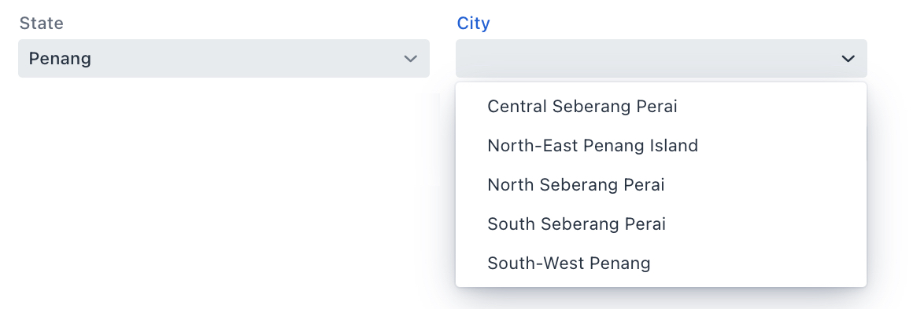

     

    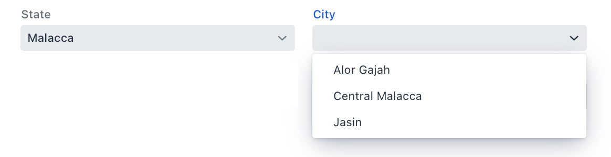

 

Note: When a value is looked up from a reference table, said value is copied to
the root/nominal object. Because it is a copy, the changes to reference table
will not affect the value.

E.g. The value ‘Perak’ is a state in the `DistrictStateCountry` reference
object. When Perak is selected as a lookup value, the value ‘Perak’ is copied
from `DistrictStateCountry` to the `Address` object (i.e. `Address.state` is now
equal to ‘Perak’). If ‘Perak’ is modified or deleted from `DistrictStateCountry`
, the value `Address.state` will not be affected because it contains a full copy
of the value ‘Perak’.

 

Script
------

In multiple places in Langkuik, scripts are supported. For now, we support
mainly Groovy script

-   Scripts are written directly within the XML element of a workflow. Because
    of this, complex scripts must be encapsulate in CDATA element

-   Script can have access to several system level variables

    -   `currentObject`

        -   Contains the current root object

    -   `currentClass`

        -   The class of the root object

    -   `tenant`

        -   The current tenant

    -   `userIdentifier`

        -   The current user identifier. In case of LDAP, it would be the full
            DN of the currently logged in user

    -   `user`

        -   The user login id

    -   `roles`

        -   The roles of a user

    -   `dao`

        -   The Data Access Object. Can be used to query or save an object

    -   `workflow`

        -   The current Workflow object implementing
            the`com.azrul.langkuik.framework.workflow.Workflow`interface

    -   In order to use these system variables, we just have to use the dot
        notation. For example, if we have a method called `setApproved(Boolean
        approved)`in the root object, we can do:

    ~~~~~~~~~~~~~~~~~~~~~~~~~~~~~~~~~~~~~~~~~~~~~~~~~~~~~~~~~~~~~~~~~~~~~~~~~~~~
    //To update data
    currentObject.setApproved(true);

    //To read data
    Boolean myStatus = currentObject.getApproved()
    ~~~~~~~~~~~~~~~~~~~~~~~~~~~~~~~~~~~~~~~~~~~~~~~~~~~~~~~~~~~~~~~~~~~~~~~~~~~~

-   Scripts can also import Java or Groovy libraries. We need to have those
    libraries available as dependencies (through maven) and import them in the
    script

 

### Scripting in Service

We have seen before that a Groovy script can be specified in a service. Below is
an example

~~~~~~~~~~~~~~~~~~~~~~~~~~~~~~~~~~~~~~~~~~~~~~~~~~~~~~~~~~~~~~~~~~~~~~~~~~~~~~~~
 <service
            id='S1.CALL_BUREAU'
            next='S1.1.CALL_BUREAU_DECISION'
            description='Call bureau'>
            
        </service>
~~~~~~~~~~~~~~~~~~~~~~~~~~~~~~~~~~~~~~~~~~~~~~~~~~~~~~~~~~~~~~~~~~~~~~~~~~~~~~~~

 

### Scripting in pre-run and post-run

We can associate a pre-run script to every activity in the workflow (including
`startEvent`and `end`). A pre-run script will run before the associated activity
is executed. A post-run script will be run after the associated activity is
executed

E.g: pre-run. Here we save the current time is the root through the method
`setStartTime`

~~~~~~~~~~~~~~~~~~~~~~~~~~~~~~~~~~~~~~~~~~~~~~~~~~~~~~~~~~~~~~~~~~~~~~~~~~~~~~~~
 <startEvent
            id='S0.PH'
            description="Loan PH"
            canBeStartedBy='Relationship-Manager Branch-Staff'
            next='S1.CALL_BUREAU'
            supervisoryApprovalHierarchy='Manager HOD'>
            <preRunScript>
                <![CDATA[
                    import java.time.LocalDateTime;
                 
                    System.out.println("===PRE RUN SCRIPT==");
                    currentObject.setStartTime(LocalDateTime.now());
                ;]]>
            </preRunScript>
        </startEvent>
~~~~~~~~~~~~~~~~~~~~~~~~~~~~~~~~~~~~~~~~~~~~~~~~~~~~~~~~~~~~~~~~~~~~~~~~~~~~~~~~

 

E.g post-run script. Here we retrieve back the data set using setStartTime and
calculate the duration of the workflow

~~~~~~~~~~~~~~~~~~~~~~~~~~~~~~~~~~~~~~~~~~~~~~~~~~~~~~~~~~~~~~~~~~~~~~~~~~~~~~~~
<end id='END'>
            <postRunScript>
                <![CDATA[
                    import java.time.Duration;
                    import java.time.LocalDateTime;

                    LocalDateTime start = currentObject.getStartTime();
                    LocalDateTime stop = LocalDateTime.now();
                    currentObject.setStopTime(stop);
                    Duration duration = Duration.between(start,stop);
                    System.out.println("TIME DURATION:"+duration.toSeconds()+" seconds");
                ;]]>
            </postRunScript>
        </end>
~~~~~~~~~~~~~~~~~~~~~~~~~~~~~~~~~~~~~~~~~~~~~~~~~~~~~~~~~~~~~~~~~~~~~~~~~~~~~~~~

 

Working with references
-----------------------

Reference data is data that can be referred to by the main/root object. We have
seen a few examples of these references with `WebRelation` and
`Lookup`annotations. Here we will dive a further.

###  

### Creating a reference object

To create a reference object, we need 2 things:

-   An entity representing the reference object (with`type = WebEntityType.REF`)

    E.g.

    ~~~~~~~~~~~~~~~~~~~~~~~~~~~~~~~~~~~~~~~~~~~~~~~~~~~~~~~~~~~~~~~~~~~~~~~~~~~~
    @Entity
    @Indexed
    @WebEntity(name = "District State Country", type = WebEntityType.REF)
    public class DistrictStateCountry extends Element {

        @Column(name = "DISTRICT")
        @WebField(displayName = "District", order = 200)
        @GenericField(sortable = Sortable.YES, searchable = Searchable.YES)
        @GenericField(name = "District", searchable = Searchable.YES)
        private String district;

        @Column(name = "STATE")
        @GenericField(sortable = Sortable.YES, searchable = Searchable.YES)
        @GenericField(name = "State", searchable = Searchable.YES)
        @WebField(displayName = "State", order = 300)
        private String state;

        @Column(name = "COUNTRY")
        @GenericField(sortable = Sortable.YES, searchable = Searchable.YES)
        @GenericField(name = "Country", searchable = Searchable.YES)
        @WebField(displayName = "Country", order = 400)
        private String country;

        //getters and setters ...
    }
    ~~~~~~~~~~~~~~~~~~~~~~~~~~~~~~~~~~~~~~~~~~~~~~~~~~~~~~~~~~~~~~~~~~~~~~~~~~~~

-   A view representing a way to edit the reference object

    E.g.

    ~~~~~~~~~~~~~~~~~~~~~~~~~~~~~~~~~~~~~~~~~~~~~~~~~~~~~~~~~~~~~~~~~~~~~~~~~~~~
    @Route(value = "districtStateCountry", layout = MainView.class)
    @PageTitle("District-State-Country")
    public class DistrictStateCountryMDV  extends TableView<DistrictStateCountry>{
         public DistrictStateCountryMDV(){
            super(DistrictStateCountry.class,  TableView.Mode.MAIN);
        }
    }
    ~~~~~~~~~~~~~~~~~~~~~~~~~~~~~~~~~~~~~~~~~~~~~~~~~~~~~~~~~~~~~~~~~~~~~~~~~~~~

 

### Creating a reference data administrator

One of the cool thing about Langkuik is that when a reference object is created,
the administrator interface is also automatically created for the user.

 

Before that, we would need to assign the REF_ADMIN role to the reference
administrator user. If this role does not exist, please create it.

This user must also have the rights to view-clients, view-realm and view-users.
In the example below, we created the role ‘user’ composed of all three
view-clients, view-realm and view-users. We also assign REF_ADMIN to the user

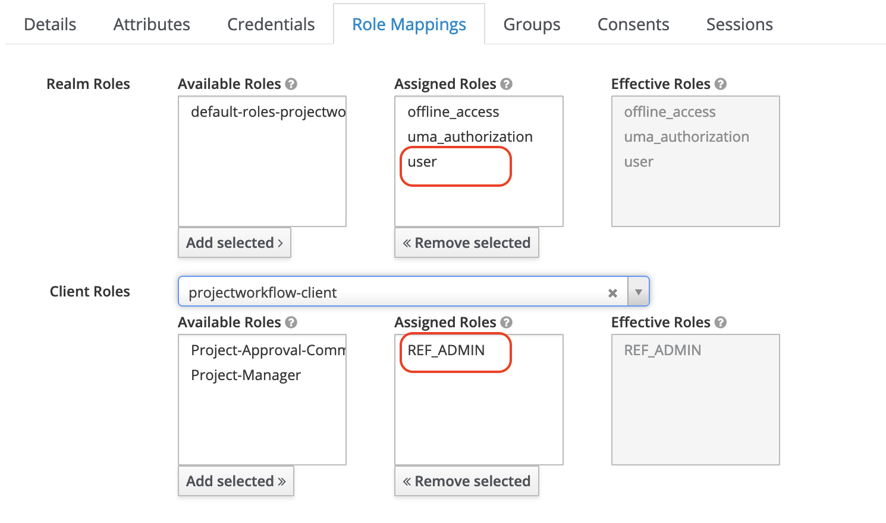

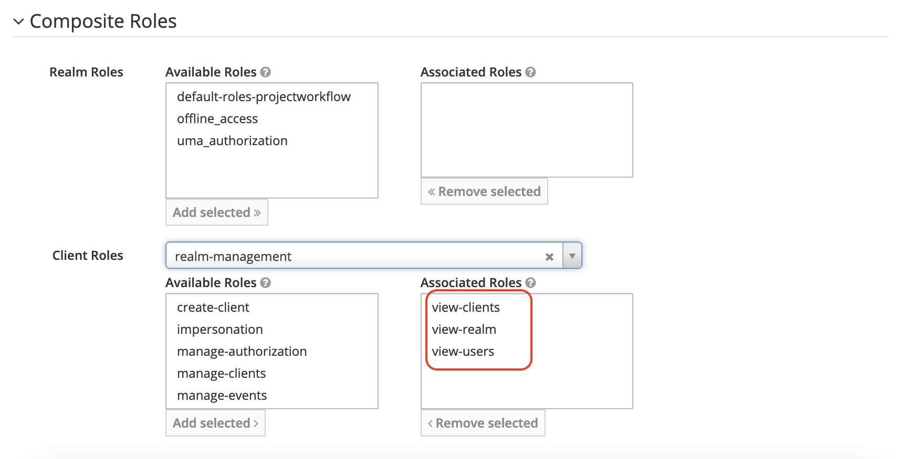

 

### Managing reference

Once we have assigned the right roles, log in as the reference administrator
user and we can create, read and update reference data

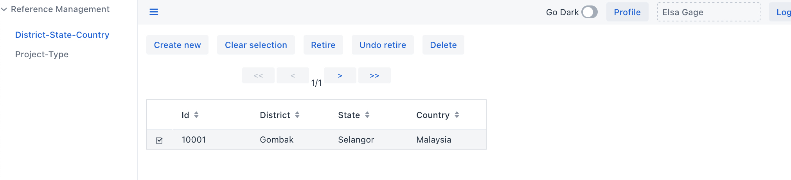

 

 

General application configuration
=================================

~~~~~~~~~~~~~~~~~~~~~~~~~~~~~~~~~~~~~~~~~~~~~~~~~~~~~~~~~~~~~~~~~~~~~~~~~~~~~~~~
#CUSTOM CONFIG
#=============
#The application port
server.port=${PORT:18080}

#Log level
logging.level.org.atmosphere = warn

#This application full URL used in the user's browser
application.lgFullurl=http://localhost:18080

#Date format (optional, default=yyyy-MM-dd)
application.lgDateFormat=yyyy-MM-dd

#Date time format  (optional, default=yyyy-MM-dd HH:mm:ss)
application.lgDateTimeFormat=yyyy-MM-dd HH:mm:ss

#Keycloak config
#---------------

#Realm being used
keycloak.realm=ProjectWorkflow

#Keycloak's URL
keycloak.auth-server-url=http://localhost:9080

#Keycloak SSL requirement
keycloak.ssl-required=external

#Keycloak client name
keycloak.resource=projectworkflow-client

#Is the client public
keycloak.public-client=true

#Keycloak's cors configuration
keycloak.cors=true

#Keycloak's id of client (
application.keycloak-id-of-client=828471a3-fa19-498b-9566-f9399084cafa

#Minio config
#------------
# Minio Host
application.minio.url=http://localhost:9000

# Minio Bucket name for your application
application.minio.bucket=projectworkflow

# Minio access key (login)
application.minio.access-key=projectworkflow

# Minio secret key (password)
application.minio.secret-key=vKBgHVhbbIhlXscOLEXLEiaZqGPgIQQs

#Database config
#---------------
#The package where the models (entity classes) are located
application.lgModelPackageName=com.azrul.langkuik.myprojectworkflow01.model

#Database driver
application.lgDatabaseDriverClassName=org.postgresql.Driver

#Database username
application.lgDatabaseUsername=projectworkflow

#Database password
application.lgDatabasePassword=1qazZAQ!

#Hibernate dialect
application.lgHibernateDialect=org.hibernate.dialect.PostgreSQL95Dialect

#JDBC URL
application.lgJdbcURL=jdbc:postgresql://localhost:5433/projectworkflow

#Hibernate update mode
application.lgDDLCreationMode=update

#show sql statement
#logging.level.org.hibernate.SQL=debug

#show sql values
#logging.level.org.hibernate.type.descriptor.sql=trace

#show cache logging
#logging.level.org.hibernate.cache=trace

#Elasticsearch config
#--------------------
#Elasticsearch username
application.lgEsUsername=elastic

#Elasticsearch password
application.lgEsPassword=ptNU3PpiCrsFA-L-wo0X

#Elasticsearch service prefix
application.lgEsServicePrefix=/

#Discovery enabled
application.lgEsDiscoveryEnabled=false

#Discovery interval
application.lgEsDiscoveryInterval=10

#Strategy 
application.lgEsStrategy=create-or-update

#URL
application.lgEsURIs=http://localhost:9200

#Profile picture
#---------------
#Dimension of the user profile (e.g. 100px X 100px)
application.lgProfilePicDimension=100

#File size limit for profile pic (in bytes)
application.lgProfilePicMaxUploadSize=1000000

#Location of profile picture in minio
application.lgProfilePicBaseMinioDir=profilePicture

#Attachments
#---------------
#File size limit for attachment (in bytes)
application.lgAttachmentMaxFileSize=2000000

#Location of attachments in minio
application.lgAttachmentBaseMinioDir=attachments

#Workflow
#---------------
#Absolute location (folder) of the workflow file. Empty means resources folder
application.lgWorkflowAbsLocation=

#Workflow file name
application.lgWorkflowFile=workflow.xml

#Workflow XML schema
application.lgWorkflowXsdUrl=https://raw.githubusercontent.com/azrulhasni/langkuik-framework-library/main/src/main/resources/workflow.xsd

#Number of rows per page
#------------------------
#Number of rows in the audit page
application.lgElementPerPageAuditTrail=10

#Number of approvals per page
application.lgElementPerPageApproval=3

#Number of attachments per page
application.lgElementPerPageAttachment=3

#Number of other things per page
application.lgElementPerPagePojo=3
~~~~~~~~~~~~~~~~~~~~~~~~~~~~~~~~~~~~~~~~~~~~~~~~~~~~~~~~~~~~~~~~~~~~~~~~~~~~~~~~

 

 
