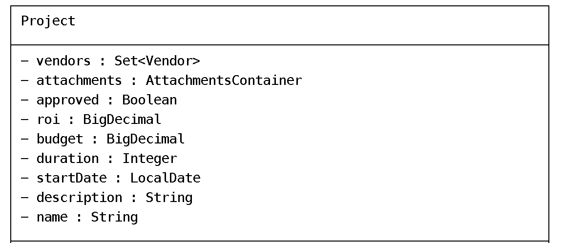
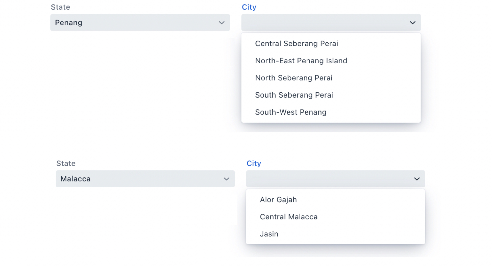
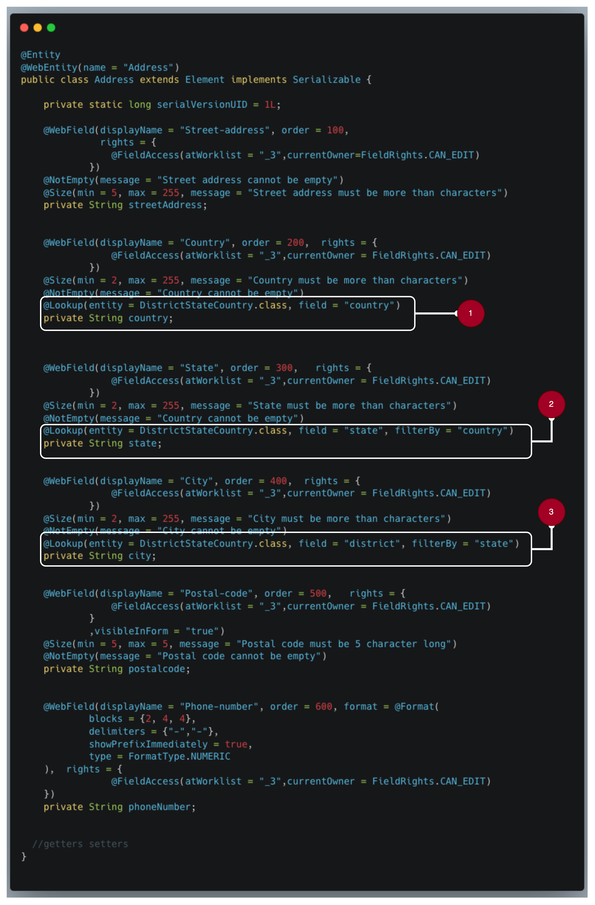
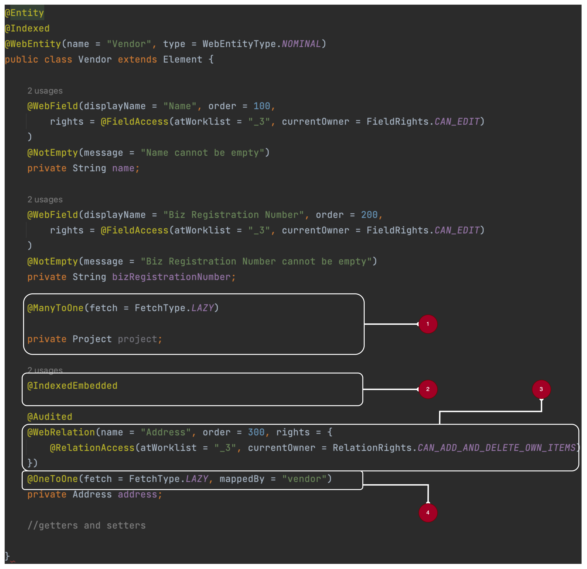
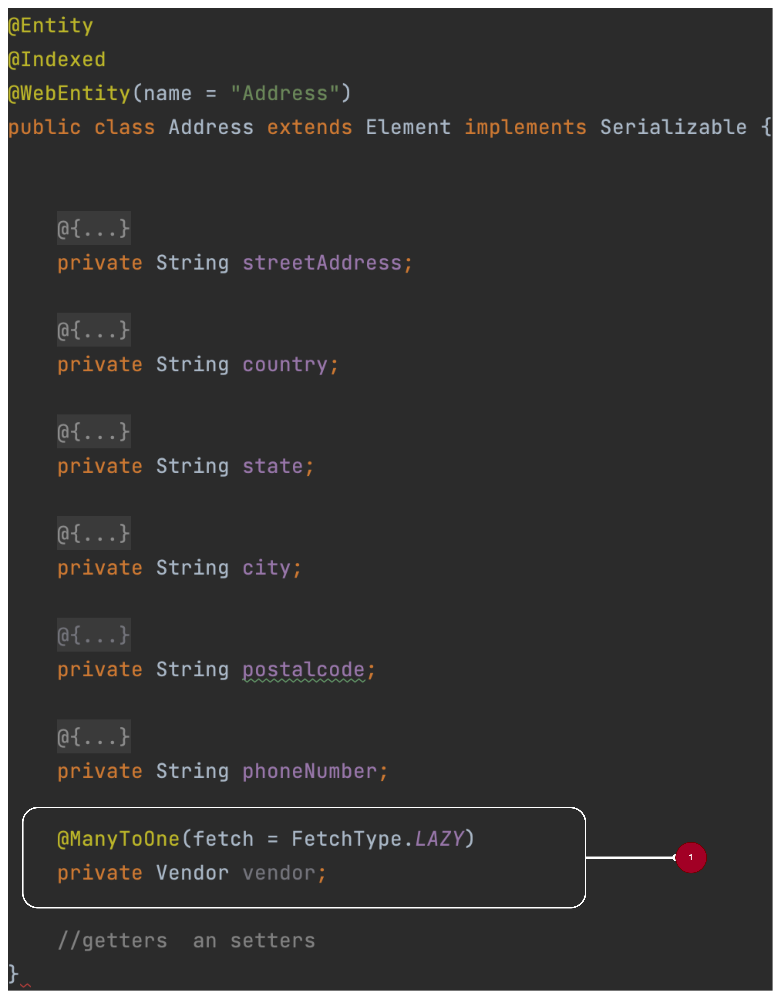

Langkuik Workflow Development -Relationship
===========================================

 

Our application
---------------

Before starting, let’s us recall our application. We wanted to implement a
project approval workflow based on the flow below:

 

Data model:

 

 

 

In this tutorial, we will We leverage typical Java field and Hibernate
annotation to represent relationship in Langkuik. We would also supplement this
with Langkuik’s own annotation

`@WebRelation`

Please see documentation for further information.

 

Lookup objects
--------------

-   Lookup objects are used as options in our data model. A typical use case is
    a list of Products or City-State-Country.

-   Let us talk about the behaviour we want to achieve. Not only that we want a
    list of possible options (e.g. list of countries), we also want, such that,
    when an option is chosen, we can use it to filter other options in the same
    form. E.g, when we choose a state in the State drop down list, only the city
    within that state appears in City drop down list

-   We also want the reverse to be true. Let’s say, a user go to the City drop
    down list before choosing a state, then:

    -   The users will be presented with all the cities

    -   Choosing a city will choose the State automatically

-   Here we will implement such lookup object. First, let us create a reference
    class representing City-State-Country

~~~~~~~~~~~~~~~~~~~~~~~~~~~~~~~~~~~~~~~~~~~~~~~~~~~~~~~~~~~~~~~~~~~~~~~~~~~~~~~~
@Entity
@WebEntity(name = "District State Country", type = WebEntityType.REF)
public class DistrictStateCountry extends Element {

    @WebField(displayName = "District", order = 100)
    private String district;

    @WebField(displayName = "State", order = 200)
    private String state;

    @WebField(displayName = "Country", order = 300)
    private String country;

    //getters and setters
}
~~~~~~~~~~~~~~~~~~~~~~~~~~~~~~~~~~~~~~~~~~~~~~~~~~~~~~~~~~~~~~~~~~~~~~~~~~~~~~~~

-   Note that the WebEntity `type` is `WebEntityType.REF`

-   Secondly, let us create an `Address` class that will use
    `DistrictStateCountry`as a look up class

1.  A typical `WebField` with `Lookup` annotation. Since country is the top most
    lookup, we just need to link the `Address`’s `country` field to the
    `DistrictStateCountry country` field

2.  In addition to linking `Address` and `DistrictStateCountry`, we also need to
    state what is the filter. In the case of states, we want to exclude states
    that does not belong to a country specified by the Address’ `country` field.
    So, in the `filterBy` properties, we specify `country`

3.  The same logic applies here, we would secondarily filter the Address’ `city`
    field by the `state` field

 

One-to-one and One-to-many
--------------------------

Next, we will attempt at modelling one-to-one and one-to-many relationships. We
will introduce the classes `Vendor`and `Address` ( as seen in the Lookup Objects
paragraph).

The class`Vendor`represents the vendors hired to deliver a particular project.

The class `Address` is used to represent the business address of the Vendor

The final structure should look like this:

 

 

*Note: To ensure searchability from root all the way to our leaf objects,
Hibernate Search insists that all relationship must be bi-directional (except
for Langkuik’s out-of-the-box classes such as AttachmentsContainer)*

 

### Modifications to the Project class

Let us take a look at our `Project` class

Note that we’ve hidden some of the annotations we’ve discussed before

 

1.  Recall that our `Project` class is searchable

2.  We use `IndexEmbedded` tag here to embed`Vendor`’s index into `Project`.
    This will allow us to search the `Vendor`from the root object (i.e.
    `Project`)

3.  One Project can have many Vendors. **Since we use**`IndexEmbedded`**, our
    relationship must be bi-directional**.

    To create a bi-directional relationship with JPA, simply indicate the field
    in`Vendor`that will point back to `Project` in the`mappedBy` annotation
    properties. In our case, the field is called `project`.

4.  In a one-to-many relationship, we can indicate the minimum and maximum
    number of elements we can link to. By default, minimum is 0 and maximum is
    -1 - i.e. no limit.

5.  This indicates that we want to display the relationship with the default
    renderer (relationship will be shown as a table of related objects) and this
    table will be displayed directly in the parent object

6.  Just like `AttachmentsContainer`, we will constraint when a `Vendor`can be
    linked to the `Project`. In this case, a `Vendor`can only be linked at the
    start of a workflow at correction (_3)

 

### Vendor class

1.  This is where we complete the bi-directional mapping from `Project` to
    `Vendor`

2.  From `Vendor` we will connect to `Address`using a one-to-one relationship.
    Here, again we embed the `Address`’ index into `Vendor` and, as we saw
    before,`Vendor`’s index into `Project`. This will allow us to search for
    `Vendor` and `Address` directly from `Project`

3.  We annotate the relationship with `WebRelation` with proper access rights

4.  This is where the one-to-one relationship is expressed

 

### Modifications to the Address class

1.  With the `Address` class, we need to add the field `vendor`to implement our
    bi-directional relationship

 

In order for search to be effective, we would need to follow the conventions set
in the Lucene Query Language paragraph in our documentation.

 

 

 

 

 
