 

In this tutorial, we will explore the features of Langkuik through examples.

The first example is a project approval workflow.

 

### Workflow

A project Manager can start a project by creating a project in Langkuik. The
project then flows to a Project Approval Committee. The committee can either
approve the project or reject it. A rejected project will flow back to the
Project Manager.

Note that a rejected project will flow to the Project Manager through a
different activity (activity \_3) instead of the original Start activity
(activity \_0).

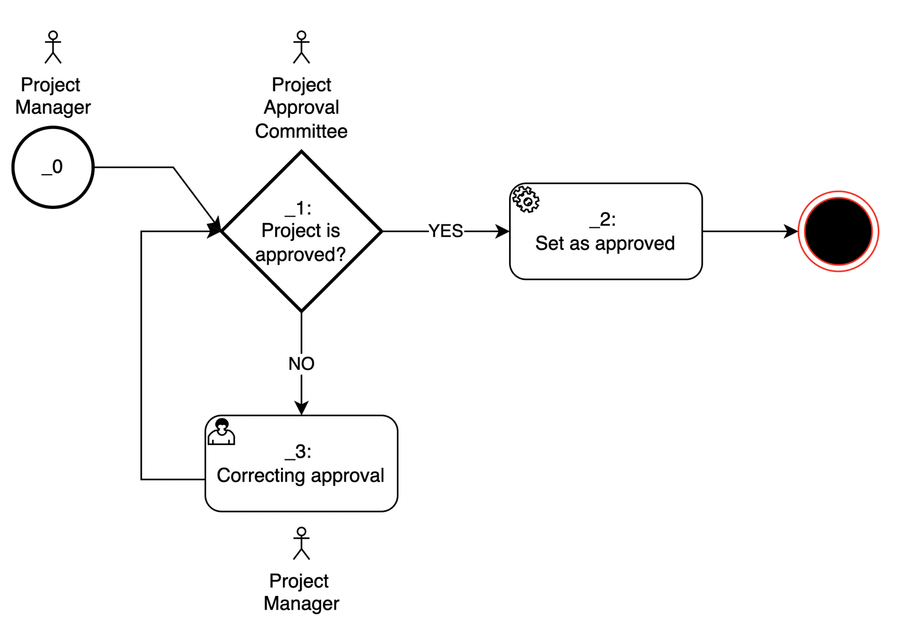

### Users and roles

In order for us to execute the workflow, we will need to create a few users and
their roles. As we have seen in the workflow, there are 2 distinct roles:
Project Manager and Project Approval Committee. Let us create a few users under
these roles:

-   Project Manager

    -   Susan Calvin (susan.calvin\@company.com)

-   Project Approval Committee

    -   Peter Bogert (peter.bogert\@company.com)

    -   Alfred Lanning (Alfred.lanning\@company.com)

 

### Data model

Let us now take a look at the data model we need.

Fields:

-   name

    -   Type: String

    -   Description: The project name

-   description

    -   Type: String

    -   Description: The project description

-   startDate

    -   Type: Date

    -   Description: The project start date

-   budget

    -   Type: Money

    -   Description: The project budget

-   duration

    -   Type: Integer

    -   Description: The project duration in months

-   roi

    -   Type: Decimal number (we will use Java’s BigDecimal)

    -   Description: The project’s rod in percentage

-   approved

    -   Type: Boolean

    -   Description: Captures the stamp of approval for the project to start

-   attachments

    -   Type: Attachments:

    -   Description: Any supporting document for the project

 

### Creating a Realm in Keycloak

First, let us create a Realm

-   Access Keycloak using the admin user

-   Under the list of Realms, click on ‘Add Realm'

-   Create a Realm called ProjectWorkflow

 

### Creating a Client

-   On the left menu, click the Clients menu item

-   Click on the button ‘Create'

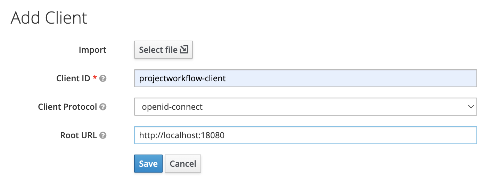

-   Fill in the fileds:

    -   Client ID : projectworkflow-client

    -   Root URL: http://localhost:18080

-   Click on Save and you will be brought to a new window, click on the Roles
    tab

 

### Creating a Client Role

 

-   Under the Roles tab, click on Add Role button

 

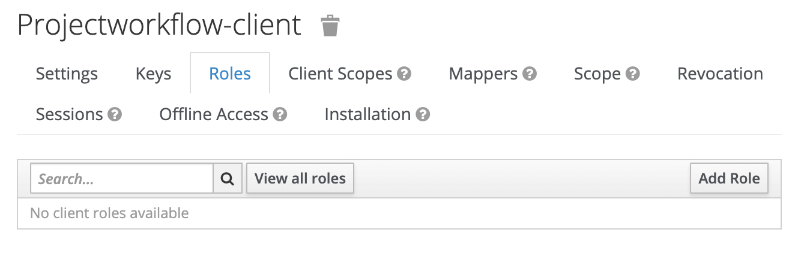

-   Add the Project Manager role

 

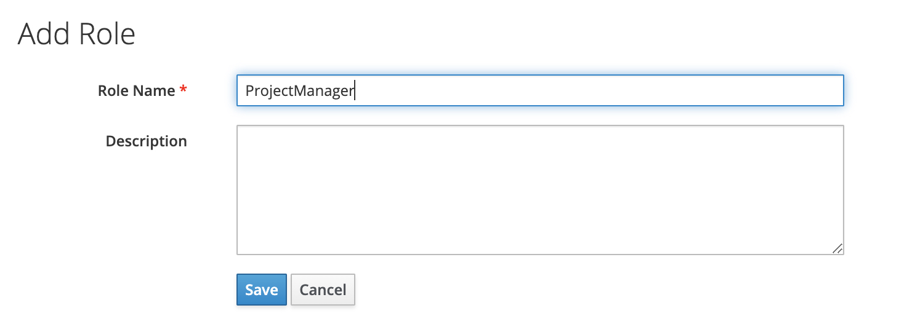

-   Do the same thing for the role Project Approval Committee

 

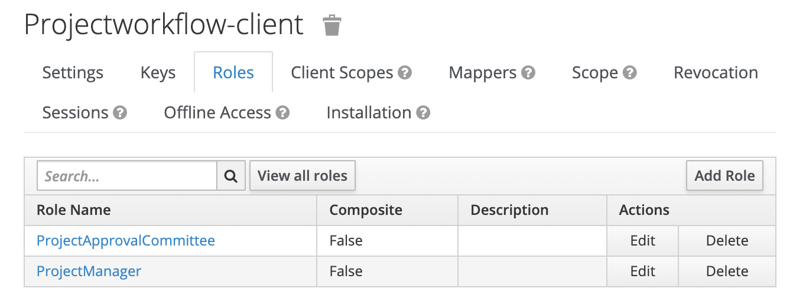

### Creating user and associating it with a client role

-   From the left side, click on the Users menu item

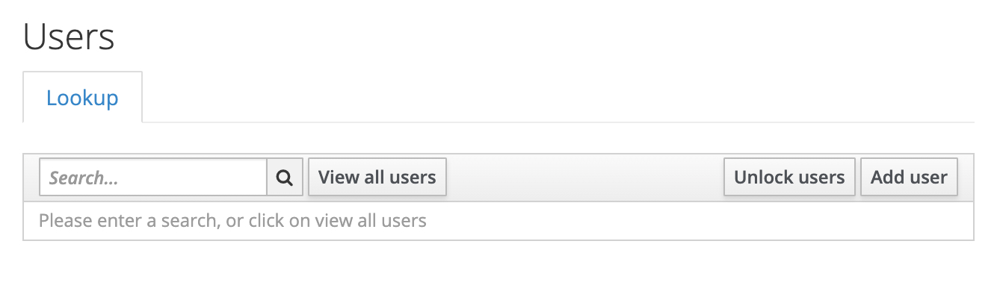

-   Click on Add user, fill in the

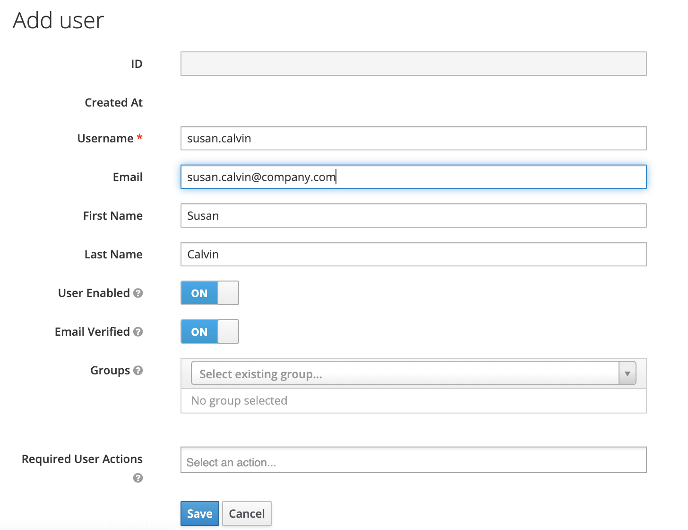

-   Click on Save, you will be brought to the next page. Click on Credentials
    where we can specify the password.

-   For this tutorial only: Put Temporary as Off

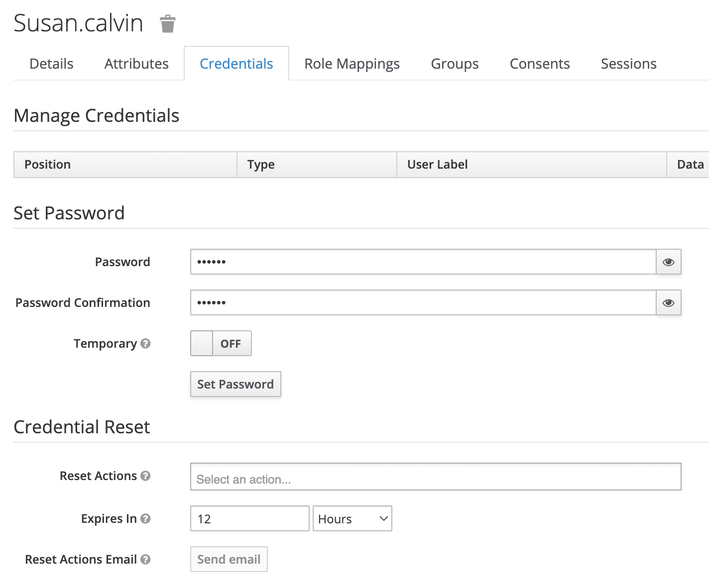

-   Then click on the Role Mappings tab. Under Client Roles, choose
    projectwokflow-client that we’ve created earlier. Select the ProjectManager
    role to be assigned to Susan Calvin.

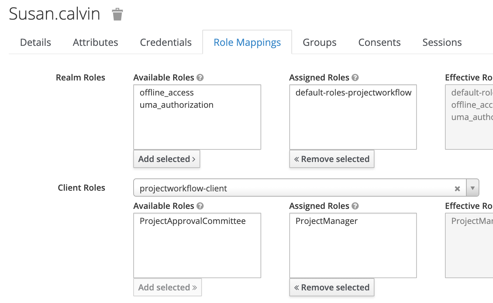

-   Repeat the same steps to create Peter Bogert and Alfred Lanning

-   Lastly, we will need the Keycloak’s client id. From the left menu, click on
    ‘Clients’ and click on ‘project workflow-client’ in the table.

-   Then, in the URL, copy the last part of the URL. We will use this later in
    our configuration

 

### Creating user role and associating

-   Firstly open up the Roles page and create a new role by clicking on Add Role

-   Give the role the name ‘user’ and save it

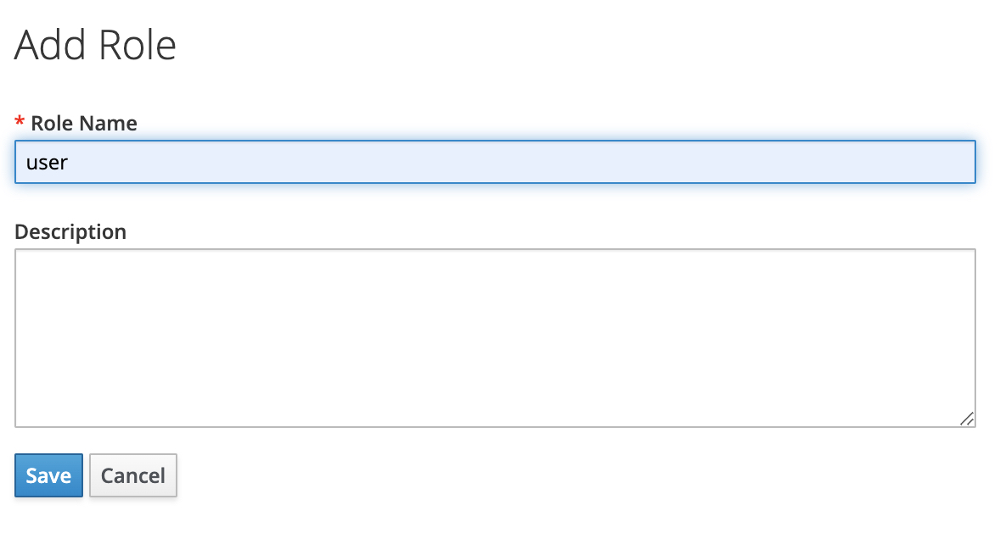

 

-   Open up the role ‘user’ and expand the Composite Role tab. In the client
    role, choose ‘realm-management'

-   Under realm-management, choose the roles below

    -   view-clients

        -   view-realm

        -   view-users

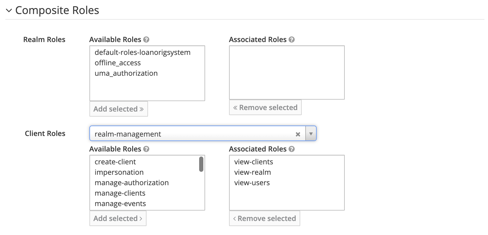

Then, open up the our user Susan Calvin and associate the role ‘user’ to her.
This role must be associated to every user

 

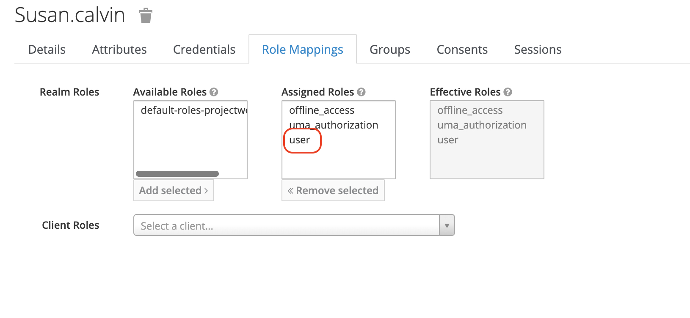

###  

 

### Create a database

-   Fire up your PgAdmin and log in as admin

-   On the left menu, click on ‘Login/Group Roles \> Create \> Login/Group
    Role...'

-   Click on the Definition tab and specify a password

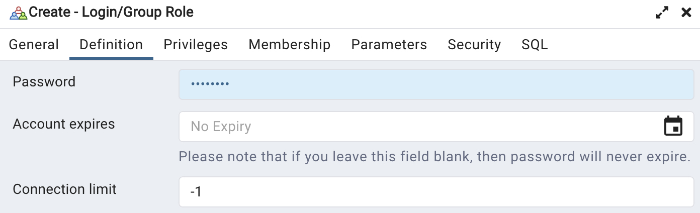

-   Click on the Privileges tab and turn on ‘Can login?'

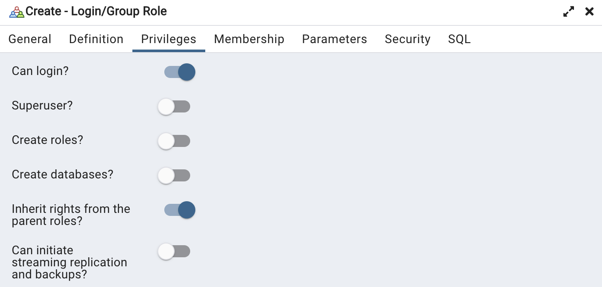

-   Save the configuration above to create a user

-   On the left menu, right click on the 'Databases \> Create \> Database..’
    menu item

-   Fill in the Database field and choose the database user we’ve created just
    now into Owner

-   Click on the Save button

 

### Create a Minio bucket

-   Log in to Minio as an admin

-   Create on the ‘Create User’ button

-   Next, create a user. From the left menu, click on Identity \> Users. Then
    click on the ‘Create’ button.

-   Fill in the form and save

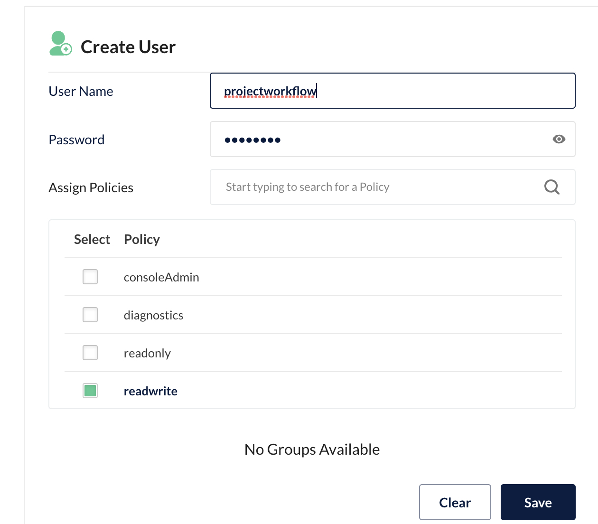

 

-   Then, from the left menu, click on Bucket. Next, click on the button ‘Create
    Bucket’. Fill in the information below

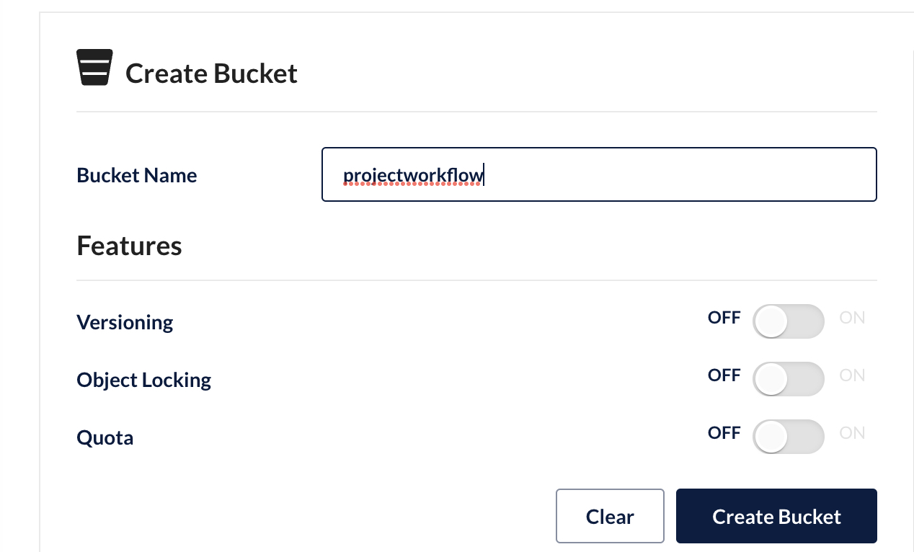

 

-   Create on the button ‘Create Bucket’ and our bucket is done

 

 

### Creating a Spring Boot project

-   We will now create a Maven project containing for our workflow. We will use
    a special Maven Archetype to achieve this.

-   Firstly, we will need Maven. If you have not installed it, please see
    installation instructions here: <https://maven.apache.org/install.html>

-   We will also need nom. Follow this documentation to do just that
    <https://docs.npmjs.com/downloading-and-installing-node-js-and-npm>

-   Use Maven to run the command below. Customise the `groupId`, `basedir` and
    `applicationName`as needed.

~~~~~~~~~~~~~~~~~~~~~~~~~~~~~~~~~~~~~~~~~~~~~~~~~~~~~~~~~~~~~~~~~~~~~~~~~~~~~~~~
>  mvn -DarchetypeGroupId=com.vaadin \
 -DarchetypeArtifactId=vaadin-archetype-spring-application \
 -DarchetypeVersion=23.0.9 \
 -DarchetypeRepository=https://repo1.maven.org/maven2/ \
 -DgroupId=com.azrul.langkuik \
 -DartifactId=project-mgmt-workflow-01 \
 -Dversion=1.0-SNAPSHOT \
 -Dpackage=com.azrul.langkuik.project.mgmt.workflow \
 -Dbasedir=/Users/azrul/Documents/GitHub \
 "-DapplicationName=My Project Workflow" \
 -Darchetype.interactive=false \
 --batch-mode org.apache.maven.plugins:maven-archetype-plugin:3.1.2:generate
~~~~~~~~~~~~~~~~~~~~~~~~~~~~~~~~~~~~~~~~~~~~~~~~~~~~~~~~~~~~~~~~~~~~~~~~~~~~~~~~

-   We will then create a project under the base directory (in the sample above,
    this is /Users/azrul/Documents/GitHub). Let’s create a shortcut to this
    folder

~~~~~~~~~~~~~~~~~~~~~~~~~~~~~~~~~~~~~~~~~~~~~~~~~~~~~~~~~~~~~~~~~~~~~~~~~~~~~~~~
> BASE_DIR=/Users/azrul/Documents/GitHub/project-mgmt-workflow-01/
> export BASE_DIR
~~~~~~~~~~~~~~~~~~~~~~~~~~~~~~~~~~~~~~~~~~~~~~~~~~~~~~~~~~~~~~~~~~~~~~~~~~~~~~~~

-   Going forward we will be using \$BASE_DIR to refer to the main workflow
    folder.

-   Fire up your favourite IDE and open the Maven project in the IDE. You will
    see the project structure below:

 

### Dependencies

-   We will need to manage dependencies on both Java and Nodejs side

-   Open up your pom.xml file and add the entries below under the
    `<dependencies>` tag

-   Please note that the versions here is what we have tested. Feel free to use
    a different version but make sure that they are compatible.

~~~~~~~~~~~~~~~~~~~~~~~~~~~~~~~~~~~~~~~~~~~~~~~~~~~~~~~~~~~~~~~~~~~~~~~~~~~~~~~~
<dependencies>
...

        <dependency>
            <groupId>com.azrul</groupId>
            <artifactId>langkuik-framework-library</artifactId>
            <version>1.0-SNAPSHOT</version>
        </dependency>
        <dependency>
            <groupId>com.squareup.okhttp3</groupId>
            <artifactId>okhttp</artifactId>
            <version>4.9.3</version>
        </dependency>
        <dependency>
            <groupId>org.springframework.security</groupId>
            <artifactId>spring-security-config</artifactId>
            <version>5.3.8.RELEASE</version>
            <type>jar</type>
        </dependency>
        <dependency>
            <groupId>org.springframework.security</groupId>
            <artifactId>spring-security-web</artifactId>
            <version>5.3.8.RELEASE</version>
            <type>jar</type>
        </dependency>
        <dependency>
            <groupId>org.keycloak</groupId>
            <artifactId>keycloak-spring-boot-starter</artifactId>
            <version>18.0.0</version>
        </dependency>
    </dependencies>
~~~~~~~~~~~~~~~~~~~~~~~~~~~~~~~~~~~~~~~~~~~~~~~~~~~~~~~~~~~~~~~~~~~~~~~~~~~~~~~~

 

-   Next, go to \$BASE_DIR and run the Maven command to build

~~~~~~~~~~~~~~~~~~~~~~~~~~~~~~~~~~~~~~~~~~~~~~~~~~~~~~~~~~~~~~~~~~~~~~~~~~~~~~~~
> cd $BASE_DIR
> mvn clean install
~~~~~~~~~~~~~~~~~~~~~~~~~~~~~~~~~~~~~~~~~~~~~~~~~~~~~~~~~~~~~~~~~~~~~~~~~~~~~~~~

-   This will compile the project and create the file package.json under
    \$BASE_DIR. Open the file and search for

~~~~~~~~~~~~~~~~~~~~~~~~~~~~~~~~~~~~~~~~~~~~~~~~~~~~~~~~~~~~~~~~~~~~~~~~~~~~~~~~
"webpack-cli": "4.9.2”
~~~~~~~~~~~~~~~~~~~~~~~~~~~~~~~~~~~~~~~~~~~~~~~~~~~~~~~~~~~~~~~~~~~~~~~~~~~~~~~~

-   We need to upgrade the version of the webpack-cli package. Change it to
    4.10.0

~~~~~~~~~~~~~~~~~~~~~~~~~~~~~~~~~~~~~~~~~~~~~~~~~~~~~~~~~~~~~~~~~~~~~~~~~~~~~~~~
"webpack-cli": "4.10.0”
~~~~~~~~~~~~~~~~~~~~~~~~~~~~~~~~~~~~~~~~~~~~~~~~~~~~~~~~~~~~~~~~~~~~~~~~~~~~~~~~

-   Save the package.json file

-   Next, go to the \$BASE_DIR again and run

~~~~~~~~~~~~~~~~~~~~~~~~~~~~~~~~~~~~~~~~~~~~~~~~~~~~~~~~~~~~~~~~~~~~~~~~~~~~~~~~
> npm install
~~~~~~~~~~~~~~~~~~~~~~~~~~~~~~~~~~~~~~~~~~~~~~~~~~~~~~~~~~~~~~~~~~~~~~~~~~~~~~~~

 

### Style

-   Next, we would want to create a centralize style sheet for our application.

-   In the folder \$BASE_DIR/frontend, create a file called
    langkuik-global-styles.css

-   Put the content below in the file and save

~~~~~~~~~~~~~~~~~~~~~~~~~~~~~~~~~~~~~~~~~~~~~~~~~~~~~~~~~~~~~~~~~~~~~~~~~~~~~~~~
[part="input-field"] {
    
}

[part="value"] { /*for text input field*/
    font-size: 13px
}

[part="summary"] { /*for accordions*/
    font-size: 13px
}

[part="drop-label"]{ /*for file drop*/
    font-size: 13px
}

label { /*for labels*/
    font-size: 13px
}

:host{ /*for tabs*/
    font-size: 13px
}

html{ /*table content*/
    font-size: 13px
}

[part~="reorder-ghost"] { /*table headers*/
    font-size: 13px
}
~~~~~~~~~~~~~~~~~~~~~~~~~~~~~~~~~~~~~~~~~~~~~~~~~~~~~~~~~~~~~~~~~~~~~~~~~~~~~~~~

-   This is where the overall style of the application is controlled. For
    example, if we want to reduce the font size, we can change the font size
    from 13px to 11px and this will be reflected in our aplication

 

 

### Create a data model

-   We will create a plain Java object to represent the data model discussed

    

1.  The annotation `@Entity` denotes that the object is persistent and the
    annotation `@Index`denotes that this object will be indexed to be search.
    These are standard JPA / Hibernate Search annotations

2.  The annotation`@WebEntity` is a Langkuik specific annotation. It indicates
    the object that represents a ‘piece of work’ that will be flowing within the
    workflow. Here, the Project class is modelling a root entity. (Please see
    the paragraph on `@WebEntity` )

3.  As a root object, the Project class must inherit from `WorkElement`. Please
    see the paragraph on `WorkElement` for more information

4.  The annotation `@GenericField` and `@KeywordField`are both part of Hibernate
    Search. This indicates that the field is searchable. Please see the
    discussion on GenericField and KeywordField.

5.  The annotation `@Audited` indicates that changes to this particular field
    will be tracked. The`@Audited`annotation is part of Hibernate Envers

6.  The annotation `@WebField`is a Langkuik’s specific annotation. It indicates
    that this field will be displayed / edited as part of the workflow. We can
    specify the order in which the field will appear as well as its access
    rights. In this particular example, we are saying: “At worklist \_3, the
    current owner of the Project can edit the Project”. Please see the paragraph
    on `@WebField`

7.  The annotation `@NotEmpty`will prevent this field to be empty

8.  The data type `LocalDate` represents locate date data type. This will be
    rendered as a date picker in our application

9.  The data type `Integer`is another supported data type

10. A field can be annotated with `@Money` to indicate that this field
    represents money

11. A field annotated with `@Money`can only support the `BigDecimal` data type.
    The text field rendered will only accept numerical values

12. A field of type `Boolean`will be rendered as a check box

13. The field of type `Attachments` represents file upload. Please see
    documentation for more.

 

### Create a workflow

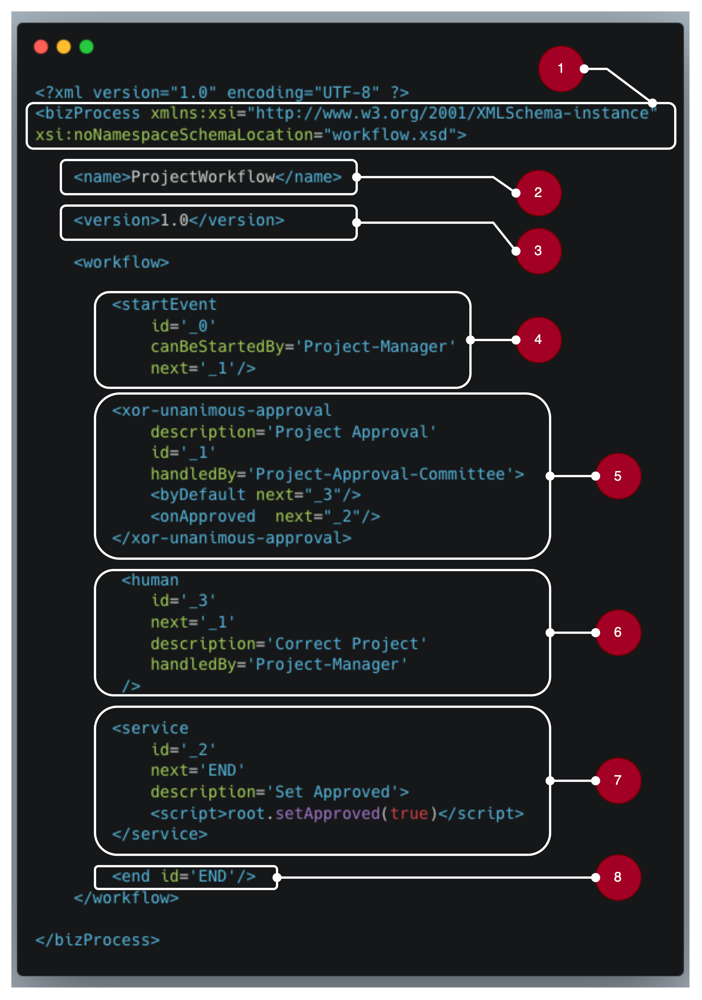

 

Running the project

 

 

 

Testing

 

Security

 

Deployment to production

 

 

 
