 

Langkuik Workflow Development -
===============================

End to end tutorial
===================

 

In this tutorial, we will explore the features of Langkuik through examples.

The first example is a project approval workflow.

 

Objective
---------

Our objective is to create a project management workflow system based on the
process below

 

### Workflow

A project Manager can start a project by creating a project in Langkuik. The
project then flows to a Project Approval Committee. The committee can either
approve the project or reject it. A rejected project will flow back to the
Project Manager.

Note that a rejected project will flow to the Project Manager through a
different activity (activity \_3) instead of the original Start activity
(activity \_0).

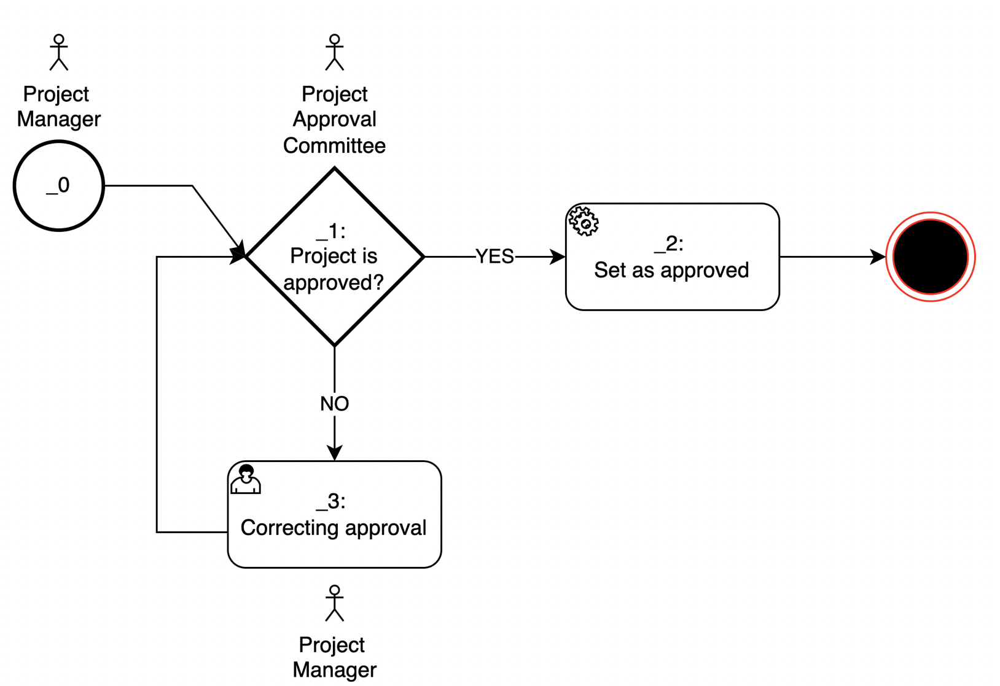

### Users and roles

In order for us to execute the workflow, we will need to create a few users and
their roles. As we have seen in the workflow, there are 2 distinct roles:
Project Manager and Project Approval Committee. Let us create a few users under
these roles:

-   Project Manager

    -   Susan Calvin (log in name: susan.calvin)

-   Project Approval Committee

    -   Steve Lanford (log in name: steve.lanford)

    -   Sadie Allyson (log in name: sadie.allyson)

 

### Data model

Let us now take a look at the data model we need.

 

Fields:

-   name

    -   Type: String

    -   Description: The project name

-   description

    -   Type: String

    -   Description: The project description

-   startDate

    -   Type: Date

    -   Description: The project start date

-   budget

    -   Type: Money

    -   Description: The project budget

-   duration

    -   Type: Integer

    -   Description: The project duration in months

-   roi

    -   Type: Decimal number (we will use Java’s BigDecimal)

    -   Description: The project’s rod in percentage

-   approved

    -   Type: Boolean

    -   Description: Captures the stamp of approval for the project to start

-   attachments

    -   Type: AttachmentsContainer:

    -   Description: Any supporting document for the project

     

     

### Architecture

Before we dive deeper into development, let us recall the architecture:

Langkuik takes advantages of different open source component to achieve its goal
as an intuitive declarative and robust workflow engine.

 

**Postgresql**

Postgresql is used as our relational database. Theoretically, Langkuik is
compatible with any JDBC compliant database

 

**Minio**

We use Minio as a distributed and robust object / file management system to
handle our attachment needs. Since Minio is S3 protocol compatible, Langkuik
should also work well with Amazon S3

 

**Keycloak**

We use Keycloak to help us manage a few things

-   As a way to connect to multiple user store / user authentication services
    such as LDAP or Active Directory.

-   As a authorisation service. Keycloak would contain all our roles management

-   Alternatively, in some set up, Keycloak can also take over from LDAP /
    Active Directory as user store

-   One advantage of Keycloak is that it enables authentication to be delegated
    to other identity datasource. Because of this, we should be able to
    integrate to any SAML or OIDC compatible user storage such as Octa or Azure
    Active Directory

 

**LDAP / Active Directory**

Many organisations have adopted LDAP or Active Directory for authentication
purposes. Having a single place to manage employees / users is very convenient
and secure. Langkuik supports LDAP or Active Directory through Keycloak.

Please refer to Keycloak documentation here for more information and setup
instructions <https://www.keycloak.org/docs/latest/server_admin/#_ldap>

 

**Open​search**

We use Opensearch as a search engine to store searchable data. We use
elasticsearch protocol and therefore is also compatible with Elasticsearch.

 

 

Development
-----------

In this section, we will show that developing the workflow above in Langkuik
would be overwhelmingly declarative. We will capture the data model above in
plain old Java object (with a few annotations) and we will capture the workflow
in an XML document.

 

### Creating a Spring Boot project

-   We will now create a Maven project containing for our workflow. We will use
    a special Maven Archetype to achieve this.

-   Firstly, we will need Maven. If you have not installed it, please see
    installation instructions here: <https://maven.apache.org/install.html>

-   We will also need nom. Follow this documentation to do just that
    <https://docs.npmjs.com/downloading-and-installing-node-js-and-npm>

-   Use Maven to run the command below. Customise the `groupId`, `basedir` and
    `applicationName`as needed.

    ~~~~~~~~~~~~~~~~~~~~~~~~~~~~~~~~~~~~~~~~~~~~~~~~~~~~~~~~~~~~~~~~~~~~~~~~~~~~
    >  mvn -DarchetypeGroupId=com.vaadin \
     -DarchetypeArtifactId=vaadin-archetype-spring-application \
     -DarchetypeVersion=23.0.9 \
     -DarchetypeRepository=https://repo1.maven.org/maven2/ \
     -DgroupId=com.azrul.langkuik \
     -DartifactId=project-mgmt-workflow-01 \
     -Dversion=1.0-SNAPSHOT \
     -Dpackage=com.azrul.langkuik.project.mgmt.workflow \
     -Dbasedir=/Users/azrul/Documents/GitHub \
     "-DapplicationName=My Project Workflow" \
     -Darchetype.interactive=false \
     --batch-mode org.apache.maven.plugins:maven-archetype-plugin:3.1.2:generate
    ~~~~~~~~~~~~~~~~~~~~~~~~~~~~~~~~~~~~~~~~~~~~~~~~~~~~~~~~~~~~~~~~~~~~~~~~~~~~

-   We will then create a project under the base directory (in the sample above,
    this is /Users/azrul/Documents/GitHub). Let’s create a shortcut to this
    folder

    ~~~~~~~~~~~~~~~~~~~~~~~~~~~~~~~~~~~~~~~~~~~~~~~~~~~~~~~~~~~~~~~~~~~~~~~~~~~~
    > BASE_DIR=/Users/azrul/Documents/GitHub/project-mgmt-workflow-01/
    > export BASE_DIR
    ~~~~~~~~~~~~~~~~~~~~~~~~~~~~~~~~~~~~~~~~~~~~~~~~~~~~~~~~~~~~~~~~~~~~~~~~~~~~

-   Going forward we will be using \$BASE_DIR to refer to the main workflow
    folder.

-   Fire up your favourite IDE and open the Maven project in the IDE. You will
    see the project structure below:

    

 

### Dependencies

-   We will need to manage dependencies on both Java and Nodejs side

-   Open up your pom.xml file and add the entries below under the
    `<dependencies>` tag

-   Please note that the versions here is what we have tested. Feel free to use
    a different version but make sure that they are compatible.

    ~~~~~~~~~~~~~~~~~~~~~~~~~~~~~~~~~~~~~~~~~~~~~~~~~~~~~~~~~~~~~~~~~~~~~~~~~~~~
    <dependencies>
    ...

            <dependency>
                <groupId>com.azrul</groupId>
                <artifactId>langkuik-framework-library</artifactId>
                <version>1.0-SNAPSHOT</version>
            </dependency>
            <dependency>
                <groupId>com.squareup.okhttp3</groupId>
                <artifactId>okhttp</artifactId>
                <version>4.9.3</version>
            </dependency>
            <dependency>
                <groupId>org.springframework.security</groupId>
                <artifactId>spring-security-config</artifactId>
                <version>5.3.8.RELEASE</version>
                <type>jar</type>
            </dependency>
            <dependency>
                <groupId>org.springframework.security</groupId>
                <artifactId>spring-security-web</artifactId>
                <version>5.3.8.RELEASE</version>
                <type>jar</type>
            </dependency>
            <dependency>
                <groupId>org.keycloak</groupId>
                <artifactId>keycloak-spring-boot-starter</artifactId>
                <version>18.0.0</version>
            </dependency>
        </dependencies>
    ~~~~~~~~~~~~~~~~~~~~~~~~~~~~~~~~~~~~~~~~~~~~~~~~~~~~~~~~~~~~~~~~~~~~~~~~~~~~

 

-   Next, go to \$BASE_DIR and run the Maven command to build

    ~~~~~~~~~~~~~~~~~~~~~~~~~~~~~~~~~~~~~~~~~~~~~~~~~~~~~~~~~~~~~~~~~~~~~~~~~~~~
    > cd $BASE_DIR
    > mvn clean install
    ~~~~~~~~~~~~~~~~~~~~~~~~~~~~~~~~~~~~~~~~~~~~~~~~~~~~~~~~~~~~~~~~~~~~~~~~~~~~

-   This will compile the project and create the file package.json under
    \$BASE_DIR. Open the file and search for

    ~~~~~~~~~~~~~~~~~~~~~~~~~~~~~~~~~~~~~~~~~~~~~~~~~~~~~~~~~~~~~~~~~~~~~~~~~~~~
    "webpack-cli": "4.9.2”
    ~~~~~~~~~~~~~~~~~~~~~~~~~~~~~~~~~~~~~~~~~~~~~~~~~~~~~~~~~~~~~~~~~~~~~~~~~~~~

-   We need to upgrade the version of the webpack-cli package. Change it to
    4.10.0

    ~~~~~~~~~~~~~~~~~~~~~~~~~~~~~~~~~~~~~~~~~~~~~~~~~~~~~~~~~~~~~~~~~~~~~~~~~~~~
    "webpack-cli": "4.10.0”
    ~~~~~~~~~~~~~~~~~~~~~~~~~~~~~~~~~~~~~~~~~~~~~~~~~~~~~~~~~~~~~~~~~~~~~~~~~~~~

-   Save the package.json file

-   Next, go to the \$BASE_DIR again and run

    ~~~~~~~~~~~~~~~~~~~~~~~~~~~~~~~~~~~~~~~~~~~~~~~~~~~~~~~~~~~~~~~~~~~~~~~~~~~~
    > npm install
    ~~~~~~~~~~~~~~~~~~~~~~~~~~~~~~~~~~~~~~~~~~~~~~~~~~~~~~~~~~~~~~~~~~~~~~~~~~~~

     

### Style

-   Next, we would want to create a centralize style sheet for our application.

-   In the folder \$BASE_DIR/frontend, create a file called
    langkuik-global-styles.css

-   Put the content below in the file and save

    ~~~~~~~~~~~~~~~~~~~~~~~~~~~~~~~~~~~~~~~~~~~~~~~~~~~~~~~~~~~~~~~~~~~~~~~~~~~~
    [part="input-field"] {

    }

    [part="value"] { /*for text input field*/
        font-size: 13px
    }

    [part="summary"] { /*for accordions*/
        font-size: 13px
    }

    [part="drop-label"]{ /*for file drop*/
        font-size: 13px
    }

    label { /*for labels*/
        font-size: 13px
    }

    :host{ /*for tabs*/
        font-size: 13px
    }

    html{ /*table content*/
        font-size: 13px
    }

    [part~="reorder-ghost"] { /*table headers*/
        font-size: 13px
    }
    ~~~~~~~~~~~~~~~~~~~~~~~~~~~~~~~~~~~~~~~~~~~~~~~~~~~~~~~~~~~~~~~~~~~~~~~~~~~~

-   This is where the overall style of the application is controlled. For
    example, if we want to reduce the font size, we can change the font size
    from 13px to 11px and this will be reflected in our aplication

 

 

### Create a data model

-   We will create a plain Java object to represent the data model discussed

-   First, create a folder under
    \$BASE_DR/src/main/java/com/azrul/langkuik/project/mgmt/workflow/model. This
    will create a Java package `com.azrul.langkuik.project.workflow.model`

-   Under this package, we will create a file called Project.java (this will
    create a class called `Project`) and in the file we will code the class
    below

1.  The annotation `@Entity` denotes that the object is persistent and the
    annotation `@Index` denotes that this object will be indexed to be search.
    These are standard JPA / Hibernate Search annotations

2.  The annotation`@WebEntity` is a Langkuik specific annotation. It indicates
    the object that represents a ‘piece of work’ that will be flowing within the
    workflow. Here, the Project class is modelling a root entity. (Please see
    the paragraph on `@WebEntity` )

3.  As a root object, the Project class must inherit from `WorkElement`. Please
    see the paragraph on `WorkElement` for more information

4.  The annotation `@GenericField` and `@KeywordField`are both part of Hibernate
    Search. This indicates that the field is searchable. Please see the
    discussion on `GenericField`and `KeywordField`.

5.  The annotation `@Audited` indicates that changes to this particular field
    will be tracked. The`@Audited`annotation is part of Hibernate Envers

6.  The annotation `@WebField` is a Langkuik’s specific annotation. It indicates
    that this field will be displayed / edited as part of the workflow. The
    order of the field appearing in the form is specified by the properties
    `order`.

    We can the fields’ access rights.

    By default, except for the start node, the owner (not creator) of a work
    element cannot edit the data in the work element. This is to prevent
    information stated by the creator of the work element to be modified. To
    allow for correction (as in worklist \_3), we need to specify `@FieldAccess`
    rights.

    In this particular example, we are saying: “At worklist \_3, the current
    owner of the Project can edit the Project”.

    Please see the paragraph on `@WebField`for more information

7.  The annotation `@NotEmpty` will prevent this field to be empty

8.  The data type `LocalDate` represents locate date data type. This will be
    rendered as a date picker in our application

9.  The data type `Integer` is another supported data type

10. A field can be annotated with `@Money` to indicate that this field
    represents money

11. A field annotated with `@Money` can only support the `BigDecimal` data type.
    The text field rendered will only accept numerical values

12. A field of type `Boolean` will be rendered as a check box

13. The field of type `AttachmentsContainer` represents file upload. Do note
    that this field is annotated with `@WebRelation` (representing relationship)
    instead of `@WebField` . This is because we linking our`Project` class to
    another class : `AttachmentsContainer` (supplied by Langkuik).

    Relationship can also have access rights constraints. In the case here,
    unless we are at the creation or correction (_3) stage of a Project , we
    will not be able to upload or delete any attachment.

    Download is allowed at any stage

    Please see documentation for more info.

 

### Create a view

-   We would need to create a view for our root object.

-   Under the directory
    \$BASE_DR/src/main/java/com/azrul/langkuik/project/mgmt/workflow/views
    create a file ProjectMDV.java.

-   The view is mainly boilerplate as per below. The classes `MainView` and
    `TableView` come from Langkuik

    ~~~~~~~~~~~~~~~~~~~~~~~~~~~~~~~~~~~~~~~~~~~~~~~~~~~~~~~~~~~~~~~~~~~~~~~~~~~~
    @Route(value = "projectworkflow", layout = MainView.class)
    @RouteAlias(value = "main", layout = MainView.class)
    @RouteAlias(value = "", layout = MainView.class)
    @PageTitle("Project Workflow")
    public class ProjectMDV extends TableView<Project> {
        public ProjectMDV(){
            super(Project.class,  TableView.Mode.MAIN);
        }
    }
    ~~~~~~~~~~~~~~~~~~~~~~~~~~~~~~~~~~~~~~~~~~~~~~~~~~~~~~~~~~~~~~~~~~~~~~~~~~~~

 

### Modify Application.java

-   Open the file Application.java under
    \$BASE_DIR/src/main/java/com/azrul/langkuik/project/mgmt/workflow/

-   Add the code snippet

~~~~~~~~~~~~~~~~~~~~~~~~~~~~~~~~~~~~~~~~~~~~~~~~~~~~~~~~~~~~~~~~~~~~~~~~~~~~~~~~
@EnableAutoConfiguration(exclude = {DataSourceAutoConfiguration.class})
@ComponentScan("com.azrul.langkuik")
~~~~~~~~~~~~~~~~~~~~~~~~~~~~~~~~~~~~~~~~~~~~~~~~~~~~~~~~~~~~~~~~~~~~~~~~~~~~~~~~

-   The resulting Application.java should be as per below:

~~~~~~~~~~~~~~~~~~~~~~~~~~~~~~~~~~~~~~~~~~~~~~~~~~~~~~~~~~~~~~~~~~~~~~~~~~~~~~~~
@SpringBootApplication

//--To be added--
@EnableAutoConfiguration(exclude = {DataSourceAutoConfiguration.class})
@ComponentScan("com.azrul.langkuik")
//--To be added--

public class Application extends SpringBootServletInitializer {

    public static void main(String[] args) {
        SpringApplication.run(Application.class, args);
    }

}
~~~~~~~~~~~~~~~~~~~~~~~~~~~~~~~~~~~~~~~~~~~~~~~~~~~~~~~~~~~~~~~~~~~~~~~~~~~~~~~~

 

 

### Create a workflow

Next, under \$BASE_DIR/src/main/resources, create the file workflow.xml. The
context is per below:

Mapping the XML workflow definition to the earlier workflow diagram we have, we
will have the result below:

1.  The tag `bizProcess`is the root tag. It must point to `workflow.xsd`

2.  The tag `name` is the name of the overall business process

3.  The tag `version` contains the version of the business process

4.  The tag `description` contains a free-text description of the business
    process

5.  The tag `workflow` is where the we specify the connectivity between nodes

6.  The `startEvent` tag is where the workflow starts

7.  The `xor-unanimous-approval`tag will insist on all the member of the
    `Project-Approval-Committee` role to approve the work before it can move on

8.  If the work needed correction, it will flow to activity `_3`. Here
    a`Project-Manager` will pick up the work and help with the correction. Note
    that any `Project-Manager` can pick up a work in `_3`.

9.  If the work is approved, a script will set a special field in our data model
    (`Boolean approved`) to true

10. The `end` tag is where the workflow stops

 

### Configuration

-   Next up we will set up the configuration related to our app

-   In the folder \$BASE_DIR/src/main/resources, open the file
    application.properties. Copy the configuration below into that file

~~~~~~~~~~~~~~~~~~~~~~~~~~~~~~~~~~~~~~~~~~~~~~~~~~~~~~~~~~~~~~~~~~~~~~~~~~~~~~~~
#SYSTEM CONFIG: DO NOT TOUCH
#===========================
# Ensure application is run in Vaadin 14/npm mode
vaadin.compatibilityMode = false
spring.main.allow-bean-definition-overriding=true

#CUSTOM CONFIG
#=============
#The application port
server.port=${PORT:18080}

#This application full URL used in the user's browser
application.lgFullurl=http://localhost:18080

#Date format (optional, default=yyyy-MM-dd)
application.lgDateFormat=yyyy-MM-dd

#Date time format  (optional, default=yyyy-MM-dd HH:mm:ss)
application.lgDateTimeFormat=yyyy-MM-dd HH:mm:ss

#Keycloak config
#---------------
#Realm being used
keycloak.realm=ProjectWorkflow

#Keycloak's URL
keycloak.auth-server-url=http://localhost:9080

#Keycloak SSL requirement
keycloak.ssl-required=external

#Keycloak client name
keycloak.resource=projectworkflow-client

#Is the client public
keycloak.public-client=true

#Keycloak's cors configuration
keycloak.cors=true

#Keycloak's id of client 
application.keycloak-id-of-client=12345678-1234-1234-1234-123456789012

#Minio config
#------------
# Minio Host
application.minio.url=http://localhost:9000

# Minio Bucket name for your application
application.minio.bucket=projectworkflow

# Minio access key (login)
application.minio.access-key=projectworkflow

# Minio secret key (password)
application.minio.secret-key=ssomekey

#Database config
#---------------
#The package where the models (entity classes) are located
application.lgModelPackageName=com.azrul.langkuik.project.workflow.model

#Database driver
application.lgDatabaseDriverClassName=org.postgresql.Driver

#Database username
application.lgDatabaseUsername=projectworkflow

#Database password
application.lgDatabasePassword=somepassword123

#Hibernate dialect
application.lgHibernateDialect=org.hibernate.dialect.PostgreSQL95Dialect

#JDBC URL
application.lgJdbcURL=jdbc:postgresql://localhost:5433/projectworkflow

#Hibernate update mode
application.lgDDLCreationMode=update

#Enable audit
application.lgEnableAudit=false

#Elasticsearch config
#--------------------
#Elasticsearch username
application.lgEsUsername=elastic

#Elasticsearch password
application.lgEsPassword=somepassword

#Elasticsearch service prefix
application.lgEsServicePrefix=/

#Discovery enabled
application.lgEsDiscoveryEnabled=false

#Discovery interval
application.lgEsDiscoveryInterval=10

#Strategy 
application.lgEsStrategy=create-or-update

application.lgEsURIs=http://localhost:9200

#Profile picture
#---------------
#Dimension of the user profile (e.g. 100px X 100px)
application.lgProfilePicDimension=100

#File size limit for profile pic (in bytes)
application.lgProfilePicMaxUploadSize=1000000

#Location of profile picture in minio
application.lgProfilePicBaseMinioDir=profilePicture

#Attachments
#---------------
#File size limit for attachment (in bytes)
application.lgAttachmentMaxFileSize=2000000

#Location of attachments in minio
application.lgAttachmentBaseMinioDir=attachments

#Workflow
#---------------
#Absolute location (folder) of the workflow file. Empty means resources folder
application.lgWorkflowAbsLocation=

#Workflow file name
application.lgWorkflowFile=workflow.xml

#Number of rows per page
#------------------------
#Number of rows in the audit page
application.lgElementPerPageAuditTrail=10

#Number of approvals per page
application.lgElementPerPageApproval=3

#Number of attachments per page
application.lgElementPerPageAttachment=3

#Number of other things per page
application.lgElementPerPagePojo=3
~~~~~~~~~~~~~~~~~~~~~~~~~~~~~~~~~~~~~~~~~~~~~~~~~~~~~~~~~~~~~~~~~~~~~~~~~~~~~~~~

 

 

Setting up related systems
--------------------------

 

For development purposes, we will leverage Docker to simplify our set up. We are
using Docker Desktop as our container management engine.

Visit Docker for download links and setup information
<https://www.docker.com/get-started/>

 

### Keycloak - Set up

-   We will pull a Keycloak image and install it. We will expose the port 9080
    for applications to call Keycloak to authenticate its users. The admin user
    has the username admin and password admin. Change it as needed.

~~~~~~~~~~~~~~~~~~~~~~~~~~~~~~~~~~~~~~~~~~~~~~~~~~~~~~~~~~~~~~~~~~~~~~~~~~~~~~~~
> docker run -d -p 9080:8080 -e KEYCLOAK_ADMIN=admin -e KEYCLOAK_ADMIN_PASSWORD=admin quay.io/keycloak/keycloak:18.0.0 start-dev
~~~~~~~~~~~~~~~~~~~~~~~~~~~~~~~~~~~~~~~~~~~~~~~~~~~~~~~~~~~~~~~~~~~~~~~~~~~~~~~~

 

 

### Keycloak - Creating a Realm in Keycloak

First, let us create a Realm

-   Access Keycloak using the admin user

-   Under the list of Realms, click on ‘Add Realm'

-   Create a Realm called ProjectWorkflow

    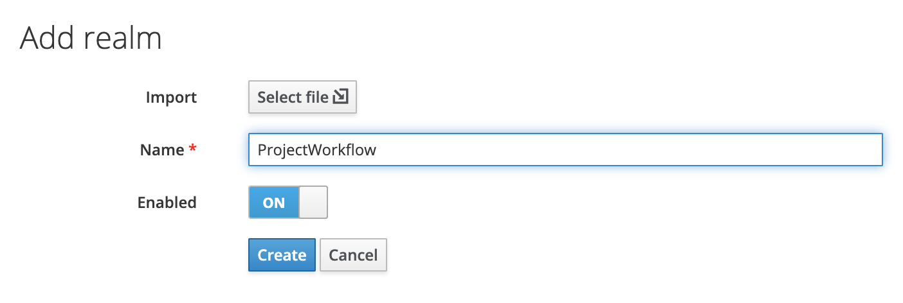

 

### Keycloak - Creating a Client

-   On the left menu, click the Clients menu item

-   Click on the button ‘Create'

    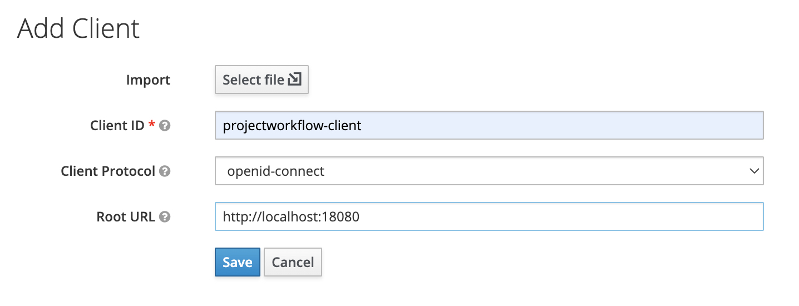

-   Fill in the fileds:

    -   Client ID : projectworkflow-client

    -   Root URL: http://localhost:18080

-   Note that we will need to specify the client id in our
    application.properties file under `keycloak.resource`

-   Click on Save and you will be brought to a new window, click on the Roles
    tab

 

### Keycloak - Creating a Client Role

 

-   Under the Roles tab, click on Add Role button

    

-   Add the Project Manager role

    

 

-   Do the same thing for the role Project Approval Committee
    (Project-Approval-Committee)

-   We would end up with the two roles as per below

    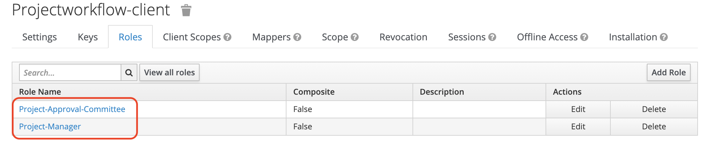

 

### Keycloak - Creating user and associating it with a client role

-   From the left side, click on the Users menu item

    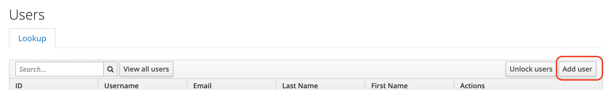

-   Click on Add user, fill in the

    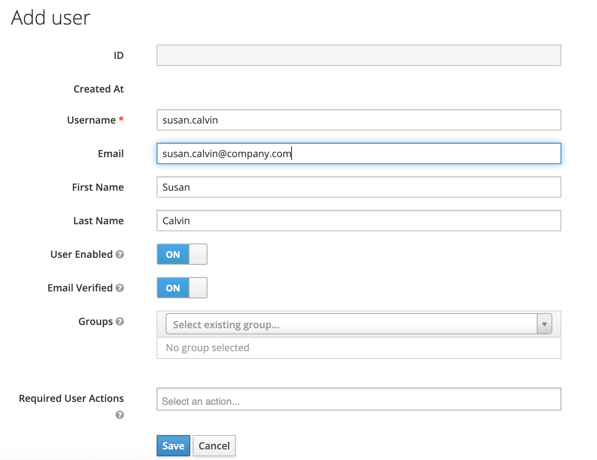

-   Click on Save, you will be brought to the next page. Click on Credentials
    where we can specify the password.

-   For this tutorial only: Put Temporary as Off

    

-   Then click on the Role Mappings tab. Under Client Roles, choose
    projectwokflow-client that we’ve created earlier. Select the Project-Manager
    role to be assigned to Susan Calvin.

    

 

 

### Keycloak - Getting id of client

-   We will need the Keycloak’s client id to enable us to do advanced query on
    Keycloak. Note that this is different from Client-ID
    (projectworkflow-client) that we specified before.

-   From the left menu, click on ‘Clients’ and click on ‘project
    workflow-client’ in the table.

-   Then, in the URL, copy the last part of the URL.

    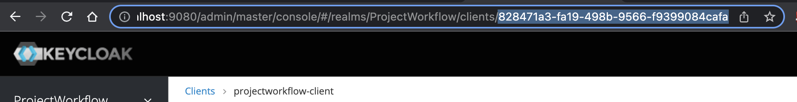

-   In our application.properties file, paste the copied client id to the
    properties  
    `application.keycloak-id-of-client`

 

### Keycloak - Creating user role and associating

-   Firstly open up the Roles page and create a new role by clicking on Add Role

    

-   Give the role the name ‘user’ and save it

    

-   Open up the role ‘user’ and expand the Composite Role tab. In the client
    role, choose ‘realm-management'

-   Under realm-management, choose the roles below

    -   view-clients

        -   view-realm

        -   view-users

            

-   Then, open up the our user Susan Calvin and associate the role ‘user’ to
    her. This role must be associated to every user

 

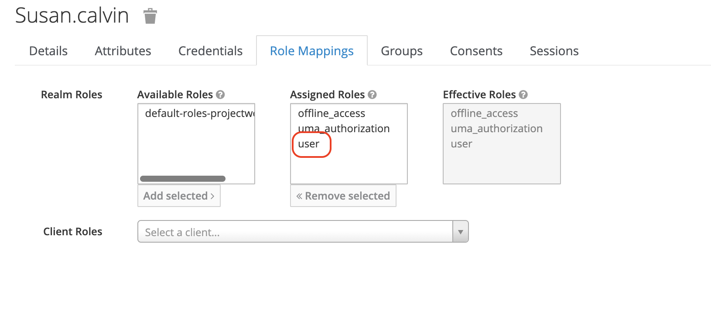

### Keycloak - creating other users

-   Repeat the same process with these users:

    -   Steve Lanford

        -   User name: steve.lanford

        -   Realm roles: user

        -   Client roles: Project-Approval-Committee (under
            projectworkflow-client)

    -   Sadie Allyson

        -   User name: sadie.allyson

        -   Realm roles: user

        -   Client roles: Project-Approval-Committee (under
            projectworkflow-client)

 

### Database - PostgreSQL setup

-   We will create a database with storage outside of our container. First,
    create a folder to hold our database storage

~~~~~~~~~~~~~~~~~~~~~~~~~~~~~~~~~~~~~~~~~~~~~~~~~~~~~~~~~~~~~~~~~~~~~~~~~~~~~~~~
> mkdir /var/lib/postgresql/data
~~~~~~~~~~~~~~~~~~~~~~~~~~~~~~~~~~~~~~~~~~~~~~~~~~~~~~~~~~~~~~~~~~~~~~~~~~~~~~~~

-   Pull the posgtres docker image

~~~~~~~~~~~~~~~~~~~~~~~~~~~~~~~~~~~~~~~~~~~~~~~~~~~~~~~~~~~~~~~~~~~~~~~~~~~~~~~~
> docker pull postgres
~~~~~~~~~~~~~~~~~~~~~~~~~~~~~~~~~~~~~~~~~~~~~~~~~~~~~~~~~~~~~~~~~~~~~~~~~~~~~~~~

-   Run the database on port 5432 while exposing 5433 externally. Note also that
    we are running the database accessible from the URL http://localhost:5433.
    This URL must be used to configure the JDBC URL in our
    application.properties file under`application.lgJdbcURL`

~~~~~~~~~~~~~~~~~~~~~~~~~~~~~~~~~~~~~~~~~~~~~~~~~~~~~~~~~~~~~~~~~~~~~~~~~~~~~~~~
> docker run --name postgresql \
  -e POSTGRES_USER=postgres \
  -e POSTGRES_PASSWORD=somepassword123 \
  -p 5433:5432 \
  -v /Users/azrul/postgres-data:/var/lib/postgresql/data \
  -d postgres
~~~~~~~~~~~~~~~~~~~~~~~~~~~~~~~~~~~~~~~~~~~~~~~~~~~~~~~~~~~~~~~~~~~~~~~~~~~~~~~~

 

### Database - PgAdmin set up

Next, we will set up PgAdmin. PgAdmin is the database management UI for
Postgresql. This will allow us to query and manipulate data directly in the
database

-   First, pull the PgAdmin image

    ~~~~~~~~~~~~~~~~~~~~~~~~~~~~~~~~~~~~~~~~~~~~~~~~~~~~~~~~~~~~~~~~~~~~~~~~~~~~
    > docker pull dpage/pgadmin4
    ~~~~~~~~~~~~~~~~~~~~~~~~~~~~~~~~~~~~~~~~~~~~~~~~~~~~~~~~~~~~~~~~~~~~~~~~~~~~

-   Next, set it up. The command below will run PgAdmin and expose its UI on
    port 5480. You will need the password `somepassword456`to enter the system

    ~~~~~~~~~~~~~~~~~~~~~~~~~~~~~~~~~~~~~~~~~~~~~~~~~~~~~~~~~~~~~~~~~~~~~~~~~~~~
    > docker run -d -p 5480:80 \
        -e 'PGADMIN_DEFAULT_EMAIL=user@domain.com' \
        -e 'PGADMIN_DEFAULT_PASSWORD=somepassword456' \
        -d dpage/pgadmin4 \
    ~~~~~~~~~~~~~~~~~~~~~~~~~~~~~~~~~~~~~~~~~~~~~~~~~~~~~~~~~~~~~~~~~~~~~~~~~~~~

-   Finally, point your browser to http://localhost:5480 and you will see the
    interface below.

    

 

### Database - configuration

-   Fire up your PgAdmin and log in as user `postgres`

-   We will now create a specific user for our project. The user name and
    password specified here must be transferred to our application.properties
    file under `application.lgDatabaseUsername` and
    `application.lgDatabasePassword` respectively

-   On the left menu, click on ‘Login/Group Roles \> Create \> Login/Group
    Role...'

    

-   Click on the Definition tab and specify a password

    

-   Click on the Privileges tab and turn on ‘Can login?'

    

-   Save the configuration above to create a user

-   Now, we will create a specific database for our project.

-   On the left menu, right click on the 'Databases \> Create \> Database..’
    menu item

-   Fill in the Database field and choose the database user we’ve created just
    now into Owner

    

-   Click on the Save button

 

### Minio - Setting up

-   We will install Minio with the command below

~~~~~~~~~~~~~~~~~~~~~~~~~~~~~~~~~~~~~~~~~~~~~~~~~~~~~~~~~~~~~~~~~~~~~~~~~~~~~~~~
> docker run \
  -d \
  -p 9000:9000 \
  -p 9001:9001 \
  -e "MINIO_ROOT_USER=admin" \
  -e "MINIO_ROOT_PASSWORD=somepassword789" \
  quay.io/minio/minio server /data --console-address ":9001
~~~~~~~~~~~~~~~~~~~~~~~~~~~~~~~~~~~~~~~~~~~~~~~~~~~~~~~~~~~~~~~~~~~~~~~~~~~~~~~~

-   Note that Minio is running on port 9000. This information is needed in
    application.properties file under `application.minio.url`

-   Point your browser to http://localhost:9001 and you will land on the Minio
    Console. You can use the username and password above to access Minio.

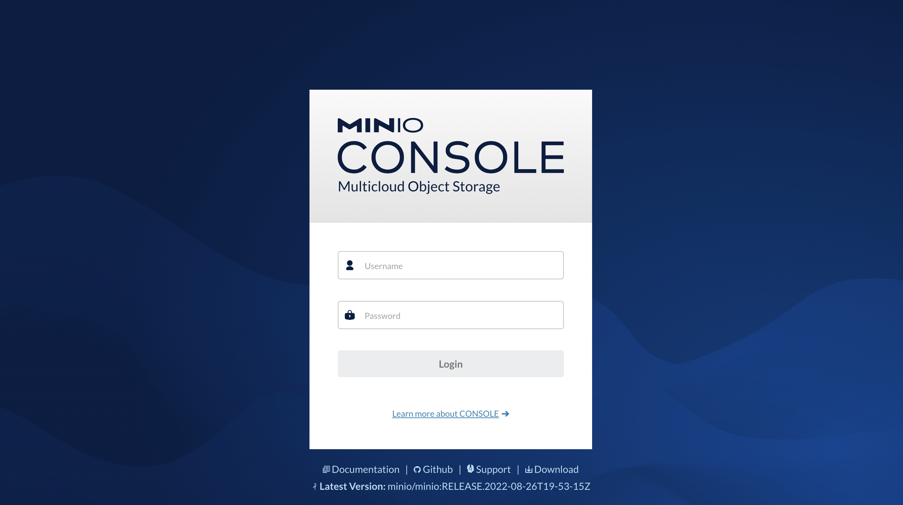

 

### Minio - Create a Minio bucket

-   Log in to Minio as an admin

-   Create on the ‘Create User’ button

-   Next, create a user. From the left menu, click on Identity \> Users. Then
    click on the ‘Create’ button.

-   Fill in the form and save. We will then need to specify the user name and
    password created here into the application.properties file under
    `application.minio.access-key` and
    `application.minio.secret-key`respectively

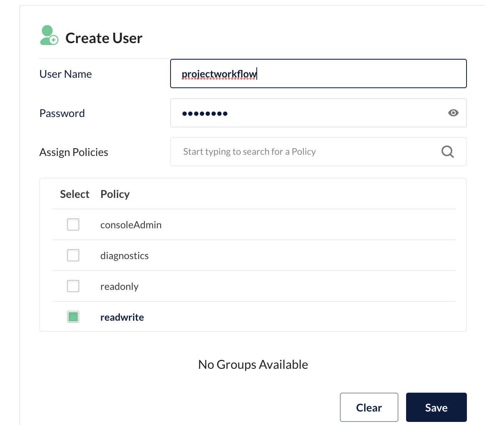

 

-   Then, from the left menu, click on Bucket. Next, click on the button ‘Create
    Bucket’. Fill in the information below. The bucket name is needed in
    application.properties file under `application.minio.bucket`

 

-   Create on the button ‘Create Bucket’ and our bucket is done

 

### Opensearch - set up

-   Under \$BASE_DIR create a folder called opensearch. In that folder, create a
    file called docker-compose.yml

-   Copy and paste the yaml code below into that file

~~~~~~~~~~~~~~~~~~~~~~~~~~~~~~~~~~~~~~~~~~~~~~~~~~~~~~~~~~~~~~~~~~~~~~~~~~~~~~~~
version: '3'
services:
  opensearch-node1:
    image: opensearchproject/opensearch:latest
    container_name: opensearch-node1
    environment:
      - cluster.name=opensearch-cluster
      - node.name=opensearch-node1
      - discovery.seed_hosts=opensearch-node1,opensearch-node2
      - cluster.initial_master_nodes=opensearch-node1,opensearch-node2
      - bootstrap.memory_lock=true # along with the memlock settings below, disables swapping
      - "OPENSEARCH_JAVA_OPTS=-Xms512m -Xmx512m" # minimum and maximum Java heap size, recommend setting both to 50% of system RAM
      - "DISABLE_INSTALL_DEMO_CONFIG=true"
      - "DISABLE_SECURITY_PLUGIN=true"
    ulimits:
      memlock:
        soft: -1
        hard: -1
      nofile:
        soft: 65536 # maximum number of open files for the OpenSearch user, set to at least 65536 on modern systems
        hard: 65536
    volumes:
      - opensearch-data1:/usr/share/opensearch/data
    ports:
      - 9200:9200
      - 9600:9600 # required for Performance Analyzer
    networks:
      - opensearch-net
  opensearch-dashboards:
    image: opensearchproject/opensearch-dashboards:latest
    container_name: opensearch-dashboards
    ports:
      - 5601:5601
    expose:
      - "5601"
    environment:
      OPENSEARCH_HOSTS: '["https://opensearch-node1:9200","https://opensearch-node2:9200"]'
    networks:
      - opensearch-net

volumes:
  opensearch-data1:

networks:
  opensearch-net:
~~~~~~~~~~~~~~~~~~~~~~~~~~~~~~~~~~~~~~~~~~~~~~~~~~~~~~~~~~~~~~~~~~~~~~~~~~~~~~~~

-   When we run the yaml file above, it will install two nodes of opensearch and
    the opensearch dashboard

-   Note the lines:

~~~~~~~~~~~~~~~~~~~~~~~~~~~~~~~~~~~~~~~~~~~~~~~~~~~~~~~~~~~~~~~~~~~~~~~~~~~~~~~~
  - "DISABLE_INSTALL_DEMO_CONFIG=true"
  - "DISABLE_SECURITY_PLUGIN=true"
~~~~~~~~~~~~~~~~~~~~~~~~~~~~~~~~~~~~~~~~~~~~~~~~~~~~~~~~~~~~~~~~~~~~~~~~~~~~~~~~

-   This will disable security such as SSL. We will do this only in our
    development machine

-   Run the yaml file above. Fire up your command line console and point it to
    \$BASE_DIR/opensearch and run:

~~~~~~~~~~~~~~~~~~~~~~~~~~~~~~~~~~~~~~~~~~~~~~~~~~~~~~~~~~~~~~~~~~~~~~~~~~~~~~~~
> docker-compose up -d
~~~~~~~~~~~~~~~~~~~~~~~~~~~~~~~~~~~~~~~~~~~~~~~~~~~~~~~~~~~~~~~~~~~~~~~~~~~~~~~~

-   This will run opensearch and opensearch dashboard on ports 9200 and 5601
    respectively

 

### Opensearch - user setup

-   In actual fact, once we disable the security requirements as per the above
    paragraph, there is no need for user name and password

 

 

Running the project
-------------------

 

-   Fire up our command line console and point it to \$BASE_DIR

-   Run the maven command below

~~~~~~~~~~~~~~~~~~~~~~~~~~~~~~~~~~~~~~~~~~~~~~~~~~~~~~~~~~~~~~~~~~~~~~~~~~~~~~~~
> mvn "-Dexec.args=-classpath %classpath com.azrul.langkuik.project.mgmt.workflow.Application" -Dexec.executable=java -Dexec.vmArgs= -Dexec.appArgs= org.codehaus.mojo:exec-maven-plugin:3.0.0:exec
~~~~~~~~~~~~~~~~~~~~~~~~~~~~~~~~~~~~~~~~~~~~~~~~~~~~~~~~~~~~~~~~~~~~~~~~~~~~~~~~

-   We should then obtain the output below

-   Point our browser to http://localhost:18080 and you will obtain the the
    Keycloak login page

-   Login using the user susan.calvin as we created before in the paragraph
    Keycloak - Creating user and associating it with a client role

-   Log in and we will see the landing page below

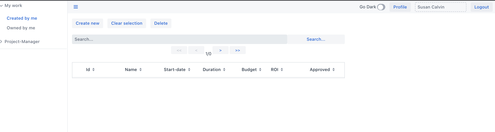

 

Testing
-------

 

-   We will test the workflow in a ‘happy path’ scenario where approval is given
    the first time around

-   We will also test the workflow in a ‘correction needed’ scenario where the
    project was rejected at first and need correction. Once correction is done,
    the project would be re-approved.

-   Before we start testing, let’s recall our workflow and actors

    -   Susan Calvin: Project Manager

    -   Sadie Allyson: Project Approval Committee

    -   Steve Lanford: Project Approval Committee

        

### Scenario: Happy path - creating a project

-   We will start by logging in as susan.calvin. Recall that she is a project
    manager (client role : Project-Manager) and will start the workflow.

-   We will see the landing page

-   Click on ‘Create new’ and choose ‘Work element'

-   We will then be presented with the form below. Fill in the information and
    click ’Save and submit'

-   Once submitted, we will see the work registered under ‘Created by me’ folder

    

-   Double-clicking on the row Id: 10000, we will see the page similar to the
    one we have before. Clicking on ‘Approval’ button will show us whose
    approval are we waiting for at at what stage of the workflow are we.

-   Note that we are correctly at stage \_1 and both Sadie Allyson and Steve
    Lanford, who are part of the Project Approval Committee, will need to
    approve our project.

 

### Scenario: Happy path - approving a project

-   Recall that we need unanimous approval for a project to be considered
    approved (xor-unanimous-approval)

-   First, log in as sadie.allyson. Then click on the menu ‘Owned by me’. We
    will see the same work as above

-   Double-click on the Project and we will see the information about the
    Project.

-   Click on ‘Approvals’. Under ’This work is hereby’ choose ‘approved’. The
    click ‘Close'

-   In the main page of the Project, click on ’Save and submit’ to commit the
    approval decision we have made

-   Repeat the same approval process by Steve Lanford.

 

### Scenario: Happy path - checking the end result

-   Re log in as Susan Calvin and under the menu ‘Created by me’, we will see
    the same Project that we have created

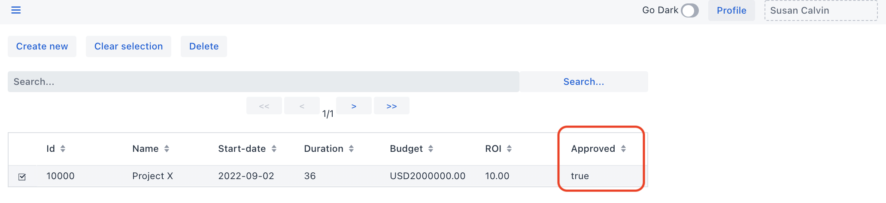

-   Notice that the ‘Approved’ flag is now set to true

-   Double-clicking on the Project will bring us to the Project page. Clicking
    on ‘Approvals’ we will see:

    -   No pending approvals needed

    -   Historical approvals are shown to be unanimously positive

 

### Scenario: Correction needed - creating a project

-   We repeat creating a project

-   Fill in the form and make sure to click ’Save and submit’. We will have the
    entry below

 

### Scenario: Correction needed - approval denied

-   Log in as Steve Lanford and click on ‘Owned by me’. We will see the entry
    for Project Z. Double-click on it

-   We will then see the Project page. Click on ‘Approvals’.

-   Firstly, we will make a comment on why this Project is rejected as per
    below. Once comment is made, click on ‘Add' and click on ‘Close’ to close
    the comment window

-   Then, under ’This work is hereby’, choose ’not approved'

-   Click on ‘Close’

-   Don’t forget to click on ’Save and submit’ on the main Project page

-   Note: Since unanimous approval is needed for the Project to proceed, a
    single disapproval is enough for us to consider the project rejected. Next
    we will see the correction flow as stated in our workflow before

 

### Scenario: Correction needed - correcting project info

-   Log in as susan.calvin again

-   Click on the menu Project-Manager and we will see the worklist ‘Correct
    Project’. Click on the worklist and we will see Project Z again sent back
    for correction

-   Double-click on the Project and we will see the main Project form.

-   The first thing we notice is that the form is not editable. This is because
    the form is still in a common worklist (Correct Project) accessible by any
    Project-Manager. For us (or rather Susan) to work (to correct) the project
    information, she would first need to book it. Click on the ‘Book this work’
    button.

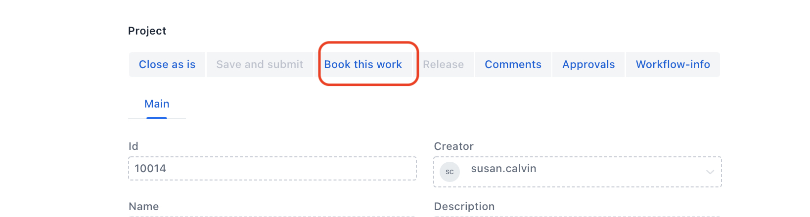

-   Once booked, the form can then be edited.

-   Firstly, let us click on the ‘Comments’ button to show us the comments made
    by the approver on why this Project was not approved.

-   We notice that, according to Steve Lanford, the ROI is low and therefore may
    not be worth investing in this project. We check our form again and we
    notice that the ROI was supposed to be 30 and we have mistakenly put 3.

-   Now let us correct the ROI to 30 instead of 3

-   We would then leave a comment to help our approvers. Click on Comments and
    add the comment below. Once we click on ‘Add’ we click on ‘Close’ to close
    the Comments window.

-   Then, on the main Project form, click on ’Save and submit'

 

### Scenario: Correction needed - accepting the correction

 

-   Log in as Steve Lanford again. Under the menu ‘Owned by me’ we will see
    Project Z once again

-   Double click on it and click on ‘Approvals'

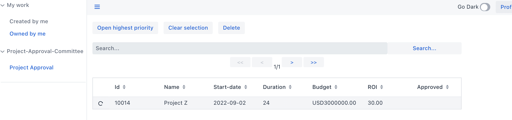

-   Under 'Approvals', we (or rather Steve) would notice that this Project came
    to the Project Approval Committee before and was rejected.

-   We can double-click on the historical approval to show us when was this
    project got rejected for approval. Close it back again

-   Steve then clicks on ‘Comments’ button to see what was the reason this
    Project was rejected before. We can see Steve’s original entry and Susan’s
    response

-   We then close the comments window, check if the ROI is now OK. Once that is
    done, we give our approval

-   Click ‘Close'

-   On the Project main form, click on ’Save and submit’ to commit the approval

-   Redo the same approval by Sadie Allyson

 

### Scenario: Correction needed - checking the end result

 

-   Log in as Susan Calvin and we will see that Project Z has been approved

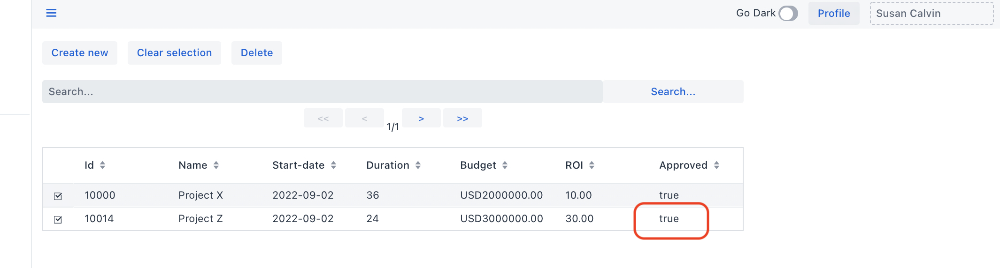

-   When we double-click on Project Z and click on the button ‘Approvals’ we
    will see the information below. We can see that the project was originally
    rejected Steve Lanford, but it was eventually approved.

 

 

 

Deployment to production
------------------------

 

There are obviously multiple ways to deploy Langkuik. Being a Spring Boot
application, it can deployed as a standalone application, as a war file to be
deployed in a Java EE application server or as a docker container running in,
say Kubernetes. Here we will use Kubernetes as a proposed way to deploy
Langkuik.

We will also look at how we integrate Langkuik with its dependencies (Minio,
PostgreSQL, OpenSearch and Keycloak). These dependencies could be deployed
themselves in multiple fashion or we could subscribe to a managed service (e.g.
S3 or RDS in AWS).

To demonstrate that we can cater for both managed and un-managed services, we
will deploy Keycloak as an unmanaged service secured using a self-signed
certificate.

 

### Proposed architecture

Below is the proposed architecture based on the discussion above:

1.  Langkuik is a workflow application. As most workflow applications are
    internal to an organisation, we suggest a Virtual Private Cloud (VPC) set
    up. This will allow us to properly isolate our application from the rest of
    the world. If Langkuik is deployed in a local corporate data centre, then we
    do not need a VPC.

2.  Connecting from a corporate network to Langkuik should be done securely
    through VPN

3.  A request traffic will land on a Load Balancer which will then redirect
    traffic to multiple availability zones (Multi-AZ). In most cloud setup, an
    availability zone is isolated enough to be ensure resiliency against any
    hardware or data centre failures.

    We also assume that both AZ would work in parallel to allow scale as well as
    resiliency.

    Our web server would serve both Langkuik and Keycloak. Any static content
    should be cached at this level.

    In an on-prem deployment, we can consider each AZ as an isolated data
    center.

4.  We see another set of Load Balancers balancing the traffic between the two
    AZs

5.  It is recommended that Langkuik and Keycloak be deployed on a Kubernetes
    cluster.

6.  Both Langkuik and Keycloak should be packaged as Docker images to be
    deployed on a Kubernetes cluster and run as pods. The advantage of this is
    clear: Kubernetes will provide an extra layer of resiliency and
    repeatability to our application. Both Langkuik and Keycloak will be
    packaged with proper certificates to secure their connectivity.

7.  As we can see here, we actually deploy Keycloak as a container instead of
    leveraging managed services. Keycloak would then connect to internal
    corporate identity provider such as Active Directory through another VPN
    secured line.

    The ’text book’ way to achieve resiliency of Keycloak is to deploy it in
    cluster. Here, we will leverage Kubernetes resiliency instead. We will
    delegate data resiliency to our managed database.

8.  For data services (RDBMS, object storage and search) we will leverage
    managed services. For on-prem deployment, we can consider the options below

    -   RDBMS: CockroadDB - a Postgresql compatible, highly resilient,
        distributed RDBMS

    -   Storage : Minio - an S3 compatible, highly resilient, distributed object
        storage

    -   Search: Elasticsearch - A highly resilient, distributed search engine

 

All our services (both Langkuik and its dependencies) are secured through TLS.
In this example, we will use self-signed SSL certificates.

 

### Building and deploying a production Docker image

-   Firstly, get a Docker Hub account for free

    -   https://hub.docker.com

    -   Recall the user name and password

-   In our application.properties, modify all `localhost` to the production URL
    of our database, Minio/S3, Keycloak and OpenSearch/ElasticSearch. We should
    also make sure these dependencies are protected using SSL.

-   In this example, we will use `host.docker.internal`, since we are running
    everything on a single host. This will allow our containers to talk to each
    other by going through that common host. The configuration is as per below:

~~~~~~~~~~~~~~~~~~~~~~~~~~~~~~~~~~~~~~~~~~~~~~~~~~~~~~~~~~~~~~~~~~~~~~~~~~~~~~~~
application.lgFullurl=https://host.docker.internal:18080

application.minio.url=https://host.docker.internal:9000

application.lgJdbcURL=jdbc:postgresql://host.docker.internal:5433/projectworkflow

application.lgEsURIs=https://host.docker.internal:9200

keycloak.auth-server-url=https://host.docker.internal:9443
~~~~~~~~~~~~~~~~~~~~~~~~~~~~~~~~~~~~~~~~~~~~~~~~~~~~~~~~~~~~~~~~~~~~~~~~~~~~~~~~

-   In this example also, we map `localhost` to`host.docker.internal`in out
    /etc/hosts. This will allow us to switch between production and development
    mode easily

-   Open /etc/hosts

~~~~~~~~~~~~~~~~~~~~~~~~~~~~~~~~~~~~~~~~~~~~~~~~~~~~~~~~~~~~~~~~~~~~~~~~~~~~~~~~
> sudo vi /etc/hosts
~~~~~~~~~~~~~~~~~~~~~~~~~~~~~~~~~~~~~~~~~~~~~~~~~~~~~~~~~~~~~~~~~~~~~~~~~~~~~~~~

-   Add an entry

~~~~~~~~~~~~~~~~~~~~~~~~~~~~~~~~~~~~~~~~~~~~~~~~~~~~~~~~~~~~~~~~~~~~~~~~~~~~~~~~
127.0.0.1 host.docker.internal
~~~~~~~~~~~~~~~~~~~~~~~~~~~~~~~~~~~~~~~~~~~~~~~~~~~~~~~~~~~~~~~~~~~~~~~~~~~~~~~~

-   Save the /etc/hosts file

 

-   Add Docker Hub credential to settings.xml

~~~~~~~~~~~~~~~~~~~~~~~~~~~~~~~~~~~~~~~~~~~~~~~~~~~~~~~~~~~~~~~~~~~~~~~~~~~~~~~~
 <servers>
        <!-- other servers -->
        
        <!-- docker hub -->
        <server>
            <id>registry.hub.docker.com</id>
            <username>azrulhasni</username>
            <password>mydockerhubpassword</password>
        </server>
    </servers>
~~~~~~~~~~~~~~~~~~~~~~~~~~~~~~~~~~~~~~~~~~~~~~~~~~~~~~~~~~~~~~~~~~~~~~~~~~~~~~~~

-   Add Jib plugin to Maven’s pom.xml

~~~~~~~~~~~~~~~~~~~~~~~~~~~~~~~~~~~~~~~~~~~~~~~~~~~~~~~~~~~~~~~~~~~~~~~~~~~~~~~~
<plugins>
    <!-- other plugins -->

    <!-- Jib plugin -->     
    <plugin>
        <groupId>com.google.cloud.tools</groupId>
        <artifactId>jib-maven-plugin</artifactId>
        <version>3.2.1</version>
        <configuration>
            <to>
                <image>azrulhasni/projectworkfow</image>
            </to>
            <container>
                <mainClass>com.azrul.langkuik.project.mgmt.workflow.Application</mainClass>
                <ports>
                    <port>18080</port>
                </ports>
                <environment>
                    <application.title>${project.name}</application.title>
                    <application.version>${project.version}</application.version>
                </environment>
            </container>
            <extraDirectories>
                <paths>src/main/jib</paths>
            </extraDirectories>
        </configuration>
    </plugin>
<plugins>
~~~~~~~~~~~~~~~~~~~~~~~~~~~~~~~~~~~~~~~~~~~~~~~~~~~~~~~~~~~~~~~~~~~~~~~~~~~~~~~~

 

-   Add production profile to Maven’s pom.xml

~~~~~~~~~~~~~~~~~~~~~~~~~~~~~~~~~~~~~~~~~~~~~~~~~~~~~~~~~~~~~~~~~~~~~~~~~~~~~~~~
     <profiles>
        <!--other profiles>

        <!--production profile>
        <profile>
            <id>production</id>
            <build>
                <plugins>
                    <plugin>
                        <groupId>com.vaadin</groupId>
                        <artifactId>vaadin-maven-plugin</artifactId>
                        <version>${vaadin.version}</version>
                        <executions>
                            <execution>
                                <goals>
                                    <goal>build-frontend</goal>
                                </goals>
                                <phase>compile</phase>
                            </execution>
                        </executions>
                        <configuration>
                            <productionMode>true</productionMode>
                        </configuration>
                    </plugin>
                </plugins>
            </build>
        </profile>
    <profiles>
~~~~~~~~~~~~~~~~~~~~~~~~~~~~~~~~~~~~~~~~~~~~~~~~~~~~~~~~~~~~~~~~~~~~~~~~~~~~~~~~

-   Go to \$BASE_DIR and run

~~~~~~~~~~~~~~~~~~~~~~~~~~~~~~~~~~~~~~~~~~~~~~~~~~~~~~~~~~~~~~~~~~~~~~~~~~~~~~~~
> mvn compile -Pproduction jib:build
~~~~~~~~~~~~~~~~~~~~~~~~~~~~~~~~~~~~~~~~~~~~~~~~~~~~~~~~~~~~~~~~~~~~~~~~~~~~~~~~

-   This will upload our image to Docker Hub

-   Next we need to pull back the image

~~~~~~~~~~~~~~~~~~~~~~~~~~~~~~~~~~~~~~~~~~~~~~~~~~~~~~~~~~~~~~~~~~~~~~~~~~~~~~~~
> docker pull azrulhasni/projectworkfow:latest
~~~~~~~~~~~~~~~~~~~~~~~~~~~~~~~~~~~~~~~~~~~~~~~~~~~~~~~~~~~~~~~~~~~~~~~~~~~~~~~~

-   Start our application

~~~~~~~~~~~~~~~~~~~~~~~~~~~~~~~~~~~~~~~~~~~~~~~~~~~~~~~~~~~~~~~~~~~~~~~~~~~~~~~~
> docker run -d -p 18080:18080 azrulhasni/projectworkfow:latest 
~~~~~~~~~~~~~~~~~~~~~~~~~~~~~~~~~~~~~~~~~~~~~~~~~~~~~~~~~~~~~~~~~~~~~~~~~~~~~~~~

 

 

### Protecting Langkuik with SSL

~~~~~~~~~~~~~~~~~~~~~~~~~~~~~~~~~~~~~~~~~~~~~~~~~~~~~~~~~~~~~~~~~~~~~~~~~~~~~~~~
> keytool -genkeypair -keyalg RSA -keysize 2048 -storetype PKCS12 -keystore langkuik.p12 -validity 365

Enter keystore password:  
Re-enter new password: 
What is your first and last name?
  [Unknown]:  Azrul MADISA
What is the name of your organizational unit?
  [Unknown]:  MyDepartment
What is the name of your organization?
  [Unknown]:  MyOrganization
What is the name of your City or Locality?
  [Unknown]:  KL
What is the name of your State or Province?
  [Unknown]:  WP
What is the two-letter country code for this unit?
  [Unknown]:  MY
Is CN=Azrul MADISA, OU=MyDepartment, O=MyOrganization, L=KL, ST=WP, C=MY correct?
  [no]:  y
Generating 2,048 bit RSA key pair and self-signed certificate (SHA256withRSA) with a validity of 365 days
 for: CN=Azrul MADISA, OU=MyDepartment, O=MyOrganization, L=KL, ST=WP, C=MY
~~~~~~~~~~~~~~~~~~~~~~~~~~~~~~~~~~~~~~~~~~~~~~~~~~~~~~~~~~~~~~~~~~~~~~~~~~~~~~~~

 

-   Change configuration in application.properties to reflect SSL

~~~~~~~~~~~~~~~~~~~~~~~~~~~~~~~~~~~~~~~~~~~~~~~~~~~~~~~~~~~~~~~~~~~~~~~~~~~~~~~~
application.lgFullurl=https://host.docker.internal:18080
~~~~~~~~~~~~~~~~~~~~~~~~~~~~~~~~~~~~~~~~~~~~~~~~~~~~~~~~~~~~~~~~~~~~~~~~~~~~~~~~

 

-   Update Keycloak

 

### Deploying Keycloak with self signed SSL certificate

-   Create a folder \$BASE_DIR/cert

-   Fire up command line console and point it to \$BASE_DIR/cert and run

~~~~~~~~~~~~~~~~~~~~~~~~~~~~~~~~~~~~~~~~~~~~~~~~~~~~~~~~~~~~~~~~~~~~~~~~~~~~~~~~
> openssl req -newkey rsa:2048 -nodes -keyout keycloak.key.pem -x509 -days 3650 -out keycloak.crt.pem
> chmod 755 keycloak.key.pem
~~~~~~~~~~~~~~~~~~~~~~~~~~~~~~~~~~~~~~~~~~~~~~~~~~~~~~~~~~~~~~~~~~~~~~~~~~~~~~~~

-   Install and run Keycloak with SSL enabled. Note that we expose 9443 as the
    HTTPS port

~~~~~~~~~~~~~~~~~~~~~~~~~~~~~~~~~~~~~~~~~~~~~~~~~~~~~~~~~~~~~~~~~~~~~~~~~~~~~~~~
> docker run -d \
  --name keycloak \
  -e KEYCLOAK_ADMIN=admin \
  -e KEYCLOAK_ADMIN_PASSWORD=admin \
  -e KC_HTTPS_CERTIFICATE_FILE=/opt/keycloak/conf/keycloak.crt.pem \
  -e KC_HTTPS_CERTIFICATE_KEY_FILE=/opt/keycloak/conf/keycloak.key.pem \
  -v $BASE_DIR/cert/keycloak.crt.pem:/opt/keycloak/conf/server.crt.pem \
  -v $BASE_DIR/cert/keycloak.key.pem:/opt/keycloak/conf/server.key.pem \
  -p 9443:8443 \
  quay.io/keycloak/keycloak:18.0.0 \
  start-dev
~~~~~~~~~~~~~~~~~~~~~~~~~~~~~~~~~~~~~~~~~~~~~~~~~~~~~~~~~~~~~~~~~~~~~~~~~~~~~~~~

-   Change our configuration in application.properties to reflect HTTPS for
    Keycloak

~~~~~~~~~~~~~~~~~~~~~~~~~~~~~~~~~~~~~~~~~~~~~~~~~~~~~~~~~~~~~~~~~~~~~~~~~~~~~~~~
keycloak.auth-server-url=https://host.docker.internal:9443
~~~~~~~~~~~~~~~~~~~~~~~~~~~~~~~~~~~~~~~~~~~~~~~~~~~~~~~~~~~~~~~~~~~~~~~~~~~~~~~~

-   Given that this is a fresh install on Keycloak, we may want to redo the
    various steps related to Keycloak that we’ve taken under the paragraph
    "Setting up related systems"

 

### Calling SSL enabled (self signed) Keycloak from Langkuik

-   For a Java application to call an HTTPS service that is protected using a
    self-signed certificate, the root certificate must be registered in the
    cacerts

-   First, find out where is your cacerts file located. Each OS might store it
    at different places. For MacOS, it is located at
    `/usr/libexec/java_home/lib/security/cacerts`

-   Let’s import our generated certificate (keycloak.crt.pem) to cacerts. Fire
    up our command line console and point to \$BASE_DIR/cert

-   Run the command below. Note that 'changeit’ is the default cacerts password.
    Replace that with yours

    ~~~~~~~~~~~~~~~~~~~~~~~~~~~~~~~~~~~~~~~~~~~~~~~~~~~~~~~~~~~~~~~~~~~~~~~~~~~~
    > sudo keytool -import -file keycloak.crt.pem -keystore "$(/usr/libexec/java_home)/lib/security/cacerts" -alias "keycloak certificate" -storepass changeit
    ~~~~~~~~~~~~~~~~~~~~~~~~~~~~~~~~~~~~~~~~~~~~~~~~~~~~~~~~~~~~~~~~~~~~~~~~~~~~

-   Run our project as per ‘Run the project’ paragraph and test the connectivity
    to Keycloak by creating a work and submitting it. Re-opening the submitted
    work and clicking on the Approval button will show us the approvers looked
    up from Keycloak

    

 

 

 

### Packaging certificate into Docker container

-   Once we have successfully call a self-signed protected service, we need to
    do the same with a containerised Langkuik

-   Unfortunately this is not straightforward. This is because, when we run
    Langkuik directly on host machine (non-containerised) we import our
    certificate (key cloak.crt.pem) into the JVM’s cacerts.

-   When we containerize a Java application, a seperate JVM is supplied with the
    image. So we would need a way to supply our certificate to the container’s
    JVM somehow

-   The way we do this is by packaging the whole carets file into the image

-   Copy the cacerts file from `/usr/libexec/java_home/lib/security/cacerts` to
    \$BASE_DIR/src/main/jib/truststore. Anything in this folder (as per our
    maven configuration) will be package alongside the application itself

-   Then change our source code to use the cacerts packaged. In the file
    \$BASE_DIR/src/main/java/com/azrul/langkuik/project/mgmt/workflow/Application.java,
    add the lines between the `START: To be added` and `END: To be added`

    ~~~~~~~~~~~~~~~~~~~~~~~~~~~~~~~~~~~~~~~~~~~~~~~~~~~~~~~~~~~~~~~~~~~~~~~~~~~~
    @SpringBootApplication
    @EnableAutoConfiguration(exclude = {DataSourceAutoConfiguration.class})
    @ComponentScan("com.azrul.langkuik")
    public class Application extends SpringBootServletInitializer {

        public static void main(String[] args) {

            //--START: To be added--
            System.setProperty("javax.net.ssl.trustStore","/truststore/cacerts");
            System.setProperty("javax.net.ssl.trustStorePassword","changeit");
            //--END: To be added--

            SpringApplication.run(Application.class, args);
        }

    }
    ~~~~~~~~~~~~~~~~~~~~~~~~~~~~~~~~~~~~~~~~~~~~~~~~~~~~~~~~~~~~~~~~~~~~~~~~~~~~

     

-   Lastly, rebuild and redeploy our docker image by following the paragraph
    'Building and deploying a production Docker image'
